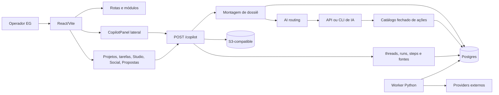
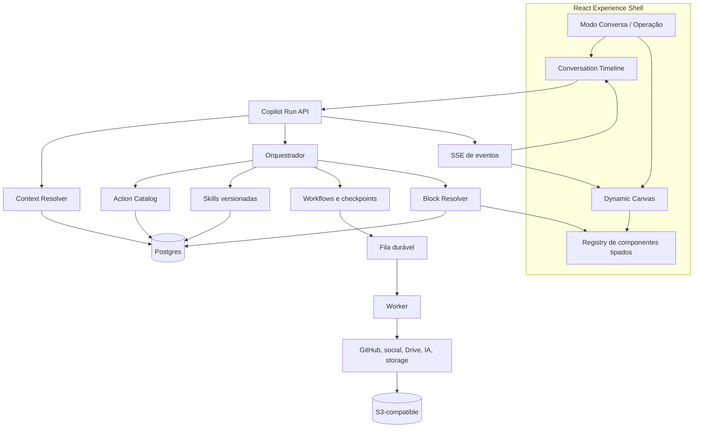
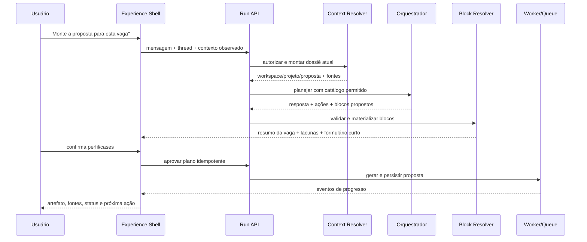
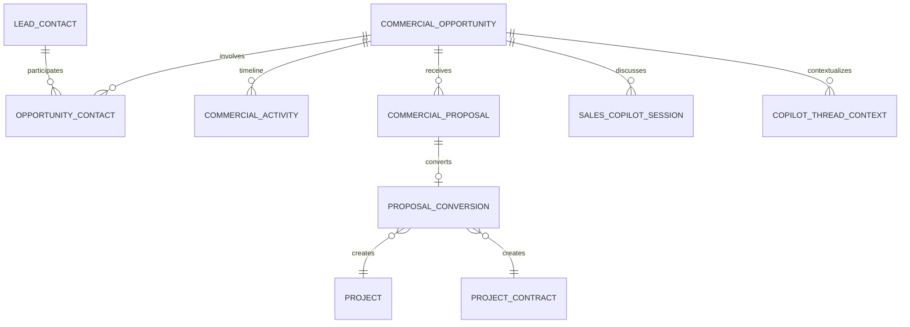
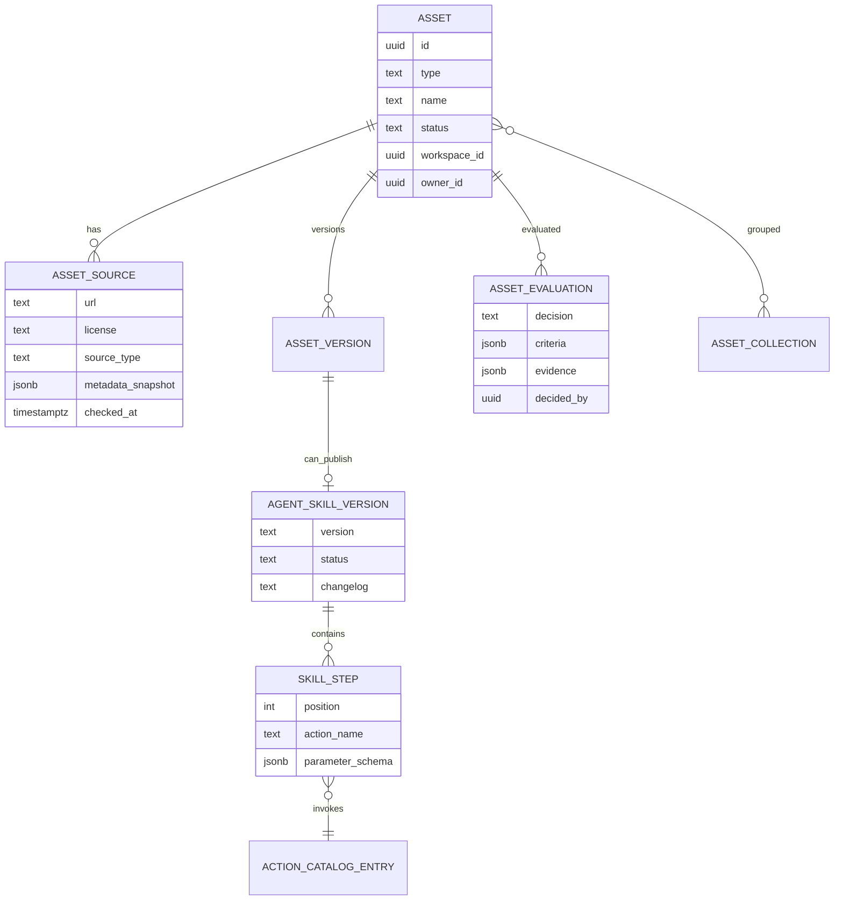

# Planejamento — Bioma Experience V2, Social Studio e Registry de Assets/Skills

**Data:** 2026-08-29
**Status:** arquitetura aprovada; primeiro corte vertical implementado em 2026-08-30
**Escopo:** Bioma ativo em `bioma/`; referências externas indicadas no briefing; fronteira com Fóton quando houver acesso ao filesystem local

---

## Estado do corte implementado

Este documento continua sendo o planejamento amplo — Social visual, registry
organizacional completo e companion local seguem como frentes posteriores. O
corte vertical implementado cobre a continuidade que faltava entre entrada,
operação e experiência do cliente:

- composer com `@Propostas`, contexto de workspace/projeto/oportunidade/proposta
  e blocos tipados renderizados por catálogo seguro;
- oportunidade com owner, próxima ação, contatos e timeline de atividades;
- Sales Copilot associado à oportunidade e capaz de devolver reunião/resumo à
  mesma continuidade comercial;
- tarefas separando contexto, critérios de aceite e Definition of Done, com
  marcação para revisão semântica dos dados legados;
- Work Graph relacional e navegável para goal/spec/story/decisão/plano,
  entregável, teste, evidência, release e asset, sem efeito em autorização;
- workspace do cliente começando por atenção, progresso e solicitações, sem
  expor o backlog interno da EG;
- migration aditiva `0106_experience_v2_foundation.sql`, contrato OpenAPI e
  testes do corte.

Os limites permanecem explícitos: WhatsApp/provider real, transcrição externa,
envio de mensagem, geração por provedor e operação diária exigem smokes e
credenciais do ambiente escolhido; build e testes locais não provam essas
integrações.

---

## 0. Decisão executiva

O Bioma não precisa ser apagado nem reescrito. O núcleo atual já tem as peças mais caras e específicas da EG: workspaces, projetos, tarefas, calendário, contexto do cliente, memória, skills revisadas, artefatos versionados, ações com HITL, rastreabilidade, integrações, storage S3-compatible e control plane de IA.

O problema central é de **composição da experiência**:

- o chat existe como painel lateral, mas ainda não é a principal porta de entrada;
- as respostas são texto, ações e fontes, sem um contrato de blocos visuais vivos;
- Studio, projetos, calendário, backlog, contexto, skills e artefatos funcionam em superfícies separadas;
- o contexto chega principalmente pela rota/workspace, ainda sem projeto como unidade explícita da conversa;
- o Copiloto é restrito à EG; liberar para clientes exige uma política própria, não apenas retirar um `require_platform_admin`;
- Social já tem geração, calendário, integrações e análise, mas não tem onboarding por URL, canvas de confirmação, biblioteca de mídia conectada nem geração real de imagens;
- o catálogo organizacional de assets/repositórios ainda não existe, embora Tech Radar, Banco de Ideias, estudos de plataforma, GitHub e skills forneçam partes reutilizáveis.

### Recomendação

Construir uma **Experience V2 incremental**, protegida por feature flag, sobre o backend atual:

1. **Modo Conversa:** chat em tela cheia, simples, com canvas contextual progressivo.
2. **Modo Operação:** navegação atual, com o mesmo chat como copiloto lateral.
3. **Blocos de UI tipados:** dashboards, tarefas, calendário, projeto, artefato, formulário e aprovação renderizados por componentes confiáveis do Bioma — nunca HTML/JS arbitrário vindo do modelo.
4. **Projeto como contexto preferencial:** workspace continua sendo a fronteira de dados; projeto vira o nó de continuidade operacional quando existir.
5. **Strangler de UX:** os módulos atuais não somem. O chat chama, resume e abre essas capacidades até que o uso prove quais telas podem ser simplificadas.
6. **Oportunidade como raiz comercial:** captura, contatos, proposta, follow-up, reunião, mensagens e conversão compartilham uma timeline.
7. **Cliente orientado a atenção e resultado:** o workspace do cliente não é a operação EG com menos menus; é Home/Conversa, aprovações, solicitações, documentos, acordos e resultados.
8. **Rastreabilidade do trabalho (Work Graph):** Goal, spec, decisões, stories, plano, tarefas, testes e assets possuem relações navegáveis sem criar fontes de verdade paralelas. Isso não representa usuários, hierarquia ou níveis de acesso.
9. **Bioma + Fóton:** o Bioma governa o registry organizacional; Fóton ou outro companion local instala/sincroniza skills e assets no filesystem dos agentes.

---

## 1. O que o briefing está pedindo de verdade

### 1.1 Uma porta de entrada simples

O referencial correto não é apenas “um chat maior”. É o comportamento que hoje funciona no ChatGPT, acrescido de continuidade operacional:

- existe um **composer universal** no qual a pessoa cola uma vaga, URL, transcrição, documento, pedido ou ideia;
- por padrão, o Bioma infere a intenção e escolhe as capacidades necessárias;
- quando quiser ser explícita, a pessoa pode chamar um especialista com `@Propostas`, `@Social`, `@Projetos`, `@Engenharia` ou outro perfil aprovado;
- a thread preserva o raciocínio e o contexto, mas o que tem valor operacional é materializado nas entidades canônicas;
- voltar pela thread ou pela entidade abre a mesma jornada, sem obrigar a pessoa a reconstruir o histórico.

Exemplo desejado ao colar uma vaga:

1. o Bioma preserva URL/texto e identifica que a intenção é comercial;
2. verifica duplicidade e cria uma oportunidade em `draft`, uma ação reversível;
3. mostra um bloco vivo com fonte, cliente/contato provável, fit, gaps e campos faltantes;
4. cruza perfil, cases e evidências aprovadas;
5. gera e versiona a proposta após a confirmação necessária;
6. registra envio, resposta, follow-up e mudança de estágio;
7. associa reuniões, transcrição, resumo e mensagens importadas;
8. quando houver ganho, converte a mesma jornada em contrato, workspace/projeto, plano, entregas e tarefas.

O chat é a **superfície de comando e continuidade**, não uma segunda base de dados. A pessoa não deveria decidir antes se precisa abrir Studio, Projetos, Propostas, Conteúdo ou Calendário; esses módulos aparecem como ferramentas, blocos ou deep links quando a intenção exigir.

### 1.2 UI viva, mas não efêmera

Durante a conversa, o Bioma deve conseguir mostrar rapidamente:

- seletor de workspace/projeto;
- resumo de dashboard;
- backlog e próximas tarefas;
- calendário;
- formulário curto para completar contexto;
- artefato gerado;
- etapa de aprovação;
- progresso de workflow.

Esses elementos podem expandir e recolher para manter a interface limpa, mas **não devem desaparecer sem histórico**. Toda saída relevante precisa continuar acessível no turno da conversa, na entidade materializada e na trilha de auditoria.

### 1.3 Workspaces como organização do trabalho

Há dois acessos complementares:

- **conversa geral da EG:** priorização da carteira, operação interna e assuntos ainda sem projeto;
- **conversa contextual:** workspace, projeto, proposta ou tarefa explicitamente selecionados ou inferidos da rota.

O workspace continua sendo a fronteira de autorização e tenancy. O projeto deve ser o nó que acumula proposta, contrato, escopo, tarefas, documentos, artefatos, comunicação e resultado.

### 1.4 Social Media por onboarding visual

O desejo não é apenas “gerar posts”. É colar URLs, reconhecer presença pública, conectar contas autorizadas, reunir imagens, confirmar identidade visual, planejar conteúdo, criar calendário e acompanhar o que performou.

### 1.5 Assets e compressão de tempo

O objetivo de “build once” é transformar descobertas e implementações boas em ativos encontráveis, avaliados e reaproveitáveis:

- repositórios base;
- componentes de UI;
- templates;
- prompts;
- skills;
- integrações;
- padrões de arquitetura;
- referências externas;
- decisões de construir, absorver, comprar ou não usar.

### 1.6 IA como pesquisadora e curadora

A IA deve ajudar a pesquisar, comparar, apontar riscos, extrair metadados e propor uma decisão. Ela não deve instalar dependência, copiar código, publicar skill ou fazer deploy sem revisão humana, licença identificada, evidência e gate apropriado.

### 1.7 Uma jornada, várias superfícies

O mesmo objeto de trabalho precisa sobreviver à troca de interface:

```text
thread ↔ oportunidade ↔ proposta ↔ reunião/mensagens ↔ contrato ↔ projeto
                                                         ├── documentos
                                                         ├── entregas
                                                         ├── tarefas
                                                         ├── aprovações
                                                         └── resultados
```

Conversa, página do lead, projeto, tarefa e workspace do cliente são projeções diferentes da mesma continuidade. Nenhuma delas deve exigir copiar e colar novamente o contexto que outra superfície já conhece.

---

## 2. Estado real do repositório

### 2.1 Checkout avaliado

- Branch: `develop`.
- Estado inicial: 8 commits à frente de `origin/develop`.
- Alterações do usuário preservadas: `logs.1786489883504.log` e `mcp-chatgpt.txt` estavam não rastreados.
- Repositório remoto: `EverGreen-Agency/evergreen-ai-os`.
- Arquitetura ativa: monorepo independente em `bioma/`; `bioma-legacy/` não governa a solução atual.

### 2.2 Stack atual

| Camada | Stack atual | Avaliação |
|---|---|---|
| Web | React 19, Vite, TypeScript, React Router, TanStack Query, Zustand, Lucide, Recharts | manter |
| API | FastAPI síncrono, Pydantic, psycopg, HTTP REST | manter |
| Dados | PostgreSQL 16, SQL parametrizado, migrações aditivas | manter |
| Jobs | worker Python e fila durável no Postgres | manter; evoluir apenas onde houver job longo |
| Storage | contrato S3-compatible via `boto3`; MinIO só como opção local no Compose | manter a abstração |
| Cache/fila futura | Redis disponível, não necessário ao fluxo principal atual | não tornar obrigatório sem evidência |
| Deploy | Vercel web; Railway API/Postgres/jobs | manter para a V2 inicial |

### 2.3 Arquitetura atual resumida



### 2.4 O que já está implementado e deve ser reaproveitado

| Capacidade | Estado encontrado |
|---|---|
| Conversas persistentes | `copilot_threads`; histórico por usuário; últimas 8 interações entram no modelo |
| Auditoria do Copiloto | runs, etapas, duração, fontes, ações, memórias, skills, tokens e conta roteada |
| Contexto | rota → workspace; tarefa explícita; tarefas da pessoa; resumo da carteira; memória; skills; índice de conhecimento |
| Ações seguras | catálogo fechado; reversível executa; irreversível/visível ao cliente exige confirmação |
| Workflows multi-etapa | `copilot_plans` com aprovação e confirmação de etapas |
| Memória | global, workspace e preferência pessoal; revisões e proveniência |
| Skills | procedimento textual, escopo, aprovação, uso e aposentadoria |
| Studio | artefatos versionados e salvamento a partir de uma run do Copiloto |
| Projetos | contrato, escopo, intake, plano, fases, entregas, documentos, updates e GitHub |
| Tarefas | backlog/board/lista/calendário/Gantt, disciplina e vínculo obrigatório para cliente |
| Social | status por frente, calendário editorial, conteúdo IA, brand book, retrospectiva, hooks, scripts e performance |
| Propostas | radar, briefing, geração, revisão, ciclo de vida e conversão idempotente em projeto |
| CRM mínimo | leads por organização, seis estágios, contato, origem, valor esperado e notas |
| Sales Copilot | sessões ligadas a workspace/proposta, participantes, consentimento, segmentos de transcrição, sugestões e ações HITL |
| WhatsApp | configuração multi-provider, envio explícito e audit log por workspace; ainda não é inbox conversacional |
| Engenharia | specs, ADRs e `tasks.md` em documentos do conhecimento, editáveis no backoffice |
| Storage | put, delete e URL GET pré-assinada via S3v4 |
| Feature flags/superfícies | liberação por organização e visibilidade em quatro níveis |
| Context Engine | corte lexical com citações que abrem na origem |

### 2.5 Lacunas confirmadas

| Lacuna | Consequência atual |
|---|---|
| Não existe rota principal de chat em tela cheia | o usuário ainda pensa em módulos antes de conversar |
| Resposta do Copiloto é texto + ações + fontes | não existe canvas dinâmico ou contrato de widgets |
| Copiloto backend exige platform admin | cliente não pode receber uma versão limitada com segurança |
| Contexto de projeto não faz parte do request do Copiloto | continuidade depende de workspace, tarefa ou texto da conversa |
| `useScopeFromRoute` só deriva workspace de cliente | superfícies como projeto, proposta e tarefa não enriquecem o escopo global do painel |
| A execução principal é HTTP síncrona | sem streaming de tokens/progresso; workflows longos têm UX fraca |
| Skills ainda são texto no dossiê | não há versão executável composta de ações tipadas |
| Conteúdo de imagem gera prompt/diretriz | mesmo no modo live, não chama um gerador de imagem nem grava mídia produzida |
| Drive aparece como backlog | não existe biblioteca unificada Drive + S3/MinIO + perfis sociais |
| Onboarding do cliente é formulário manual | website/URLs não viram evidência pré-preenchida para confirmação |
| Registry de assets não existe | Tech Radar/Ideias/Studies/GitHub não formam um catálogo reutilizável único |
| Lead, `opportunity_radar`, proposta e Sales Copilot são agregados parcialmente separados | não existe uma timeline comercial única da captura ao projeto |
| Lead mistura pessoa, empresa, estágio e valor do negócio | contato e oportunidade não têm identidades próprias; um contato com vários negócios fica ambíguo |
| Sales Copilot liga diretamente a workspace/proposta, mas não à oportunidade | reunião anterior à proposta depende de contexto manual |
| WhatsApp atual cobre configuração, envio e log; não cobre inbox, threading ou ingestão de conversa | mensagens reais não alimentam automaticamente a jornada comercial |
| `project_plans` materializa fases e entregas, não tarefas executáveis | DoD e subtarefas do plano não fecham o loop com o backlog operacional |
| `tasks.md` da Engenharia e `eg_tasks` são dois backlogs diferentes | planejamento documental pode divergir da execução real |
| A descrição da tarefa é usada como Definição de Pronto | falta separar contexto/resultado esperado, critérios de aceite e DoD |
| Documento de projeto é hoje URL + excerpt e tem poucos tipos | spec, ADR, user story, evidência e runbook não possuem relação estrutural com o trabalho |
| Tarefas não têm anexos, menções, watchers, notificações ou timeline de atividade próprios | não há paridade com suítes generalistas; colaboração depende de comentários e superfícies externas |
| API web central tem cerca de 4.800 linhas | risco crescente de acoplamento e conflito entre frentes |
| Bundle principal web com ~660 kB minificado | a V2 precisa preservar lazy loading e melhorar chunking |

### 2.6 Baseline local desta análise

- API: **285/285 testes passaram**.
- Web: **16/16 testes passaram**.
- Worker: **16/16 testes passaram** usando o Python do host; o `.venv` do worker não contém `pytest`.
- Web: `npm run build` passou; Vite alertou sobre chunks acima de 500 kB.
- Auditoria de superfície: 21 exports sem importador e 19 colunas potencialmente não lidas. O relatório declara esses itens como candidatos a revisão, não vereditos automáticos.

Isso prova apenas contratos e build locais neste checkout. Não prova migrações em banco limpo, Railway/Vercel, providers, OAuth, storage real, cotas, publicação ou uso diário.

---

## 3. Recomendação de stack

### 3.1 Manter a stack principal

Não há benefício proporcional em migrar para Next.js, trocar FastAPI, introduzir GraphQL agora, reescrever backend em Rust ou fragmentar em microserviços.

Motivos:

- os domínios e regras estão implementados e testados na stack atual;
- a V2 é uma mudança de experiência e contrato de apresentação, não de capacidade computacional;
- React/Vite já suporta chat em tela cheia, lazy loading, streaming e canvas tipado;
- FastAPI suporta REST, SSE e jobs assíncronos por coordenação com o worker;
- Postgres já é fonte de verdade, fila durável e base de auditoria;
- trocar de stack agora ampliaria o risco sem resolver o atrito do usuário.

### 3.2 Evoluções pontuais recomendadas

| Evolução | Quando | Motivo |
|---|---|---|
| SSE para eventos de run | depois do shell full-screen | tokens, progresso, tool calls e reconexão sem WebSocket prematuro |
| `copilot_run_blocks` ou `copilot_message_parts` | primeira fase de UI viva | contrato persistente e versionado para blocos visuais |
| `project_id` no contexto de run | junto do primeiro vertical slice | projeto acumula contexto sem substituir workspace |
| módulos do cliente HTTP por domínio | durante alterações tocadas | reduzir o `lib/api.ts` sem big bang |
| manual chunks/lazy imports | antes de liberar V2 amplamente | controlar bundle e tempo de abertura |
| motion library | somente após protótipo provar valor | animação é detalhe; não deve puxar Tailwind/shadcn por acidente |

### 3.3 O que não adicionar agora

- Tailwind ou shadcn apenas para copiar um componente de referência.
- WebSocket antes de provar que SSE é insuficiente.
- Redis como fila obrigatória sem limite real do Postgres.
- banco vetorial separado antes de esgotar Postgres + embeddings planejados.
- framework de agente paralelo ao Copiloto, plans e action catalog.
- “frontend gerado pelo modelo” com HTML/JS arbitrário.

---

## 4. Experience V2

### 4.1 Dois modos, um produto

Evitar o nome “Light”, porque pode ser confundido com tema claro. Sugestão:

- **Modo Conversa:** chat e canvas são a superfície principal.
- **Modo Operação:** sidebar, módulos e telas especializadas continuam visíveis.

A escolha é preferência do usuário, limitada por feature flag da organização. Cliente piloto entra inicialmente no Modo Conversa e recebe apenas capacidades autorizadas.

### 4.2 Shell proposto

```text
┌─────────────────────────────────────────────────────────────┐
│ Workspace / Projeto        Modo Conversa | Operação    Perfil│
├───────────────────────┬─────────────────────────────────────┤
│                       │ Canvas contextual                   │
│ Conversa persistente  │ - resumo / dashboard               │
│                       │ - backlog / calendário              │
│ turnos e fontes       │ - artefato / formulário            │
│ aprovações e progresso│ - aprovação / resultado            │
│                       │                                     │
├───────────────────────┴─────────────────────────────────────┤
│ Anexos · ditado · mensagem · enviar                          │
└─────────────────────────────────────────────────────────────┘
```

Em telas menores, canvas e conversa viram abas ou drawer. O painel lateral atual continua disponível no Modo Operação.

### 4.3 Contrato de blocos visuais

O modelo não devolve JSX. Ele propõe uma intenção tipada; o servidor valida autorização, resolve dados atuais e persiste o bloco.

Tipos iniciais:

| Bloco | Uso |
|---|---|
| `context_selector` | confirmar workspace/projeto quando a inferência não é segura |
| `attention_queue` | decisões, aprovações, bloqueios e próximos prazos da pessoa |
| `opportunity_summary` | fonte, contatos, estágio, fit, gaps e próxima ação comercial |
| `timeline` | eventos relacionados com origem, direção e timestamp |
| `metric_summary` | resumo operacional com fonte e timestamp |
| `score_explainer` | score, pilares, método, gargalo e evidências |
| `task_list` | backlog filtrado e ações permitidas |
| `calendar` | prazos, reuniões ou calendário editorial |
| `project_summary` | objetivo, contrato, progresso, bloqueios e próximos passos |
| `artifact` | documento/versionamento/abrir no Studio |
| `form` | perguntar apenas campos faltantes de um schema server-owned |
| `approval` | mostrar efeito, risco, idempotency key e confirmar/rejeitar |
| `client_request` | solicitação do cliente, triagem, impacto e status |
| `workflow_progress` | etapas, status, retries e bloqueios |
| `navigation_hint` | abrir um módulo existente sem retirar a pessoa da conversa |

Regras:

1. `kind` vem de catálogo fechado.
2. Payload tem versão de schema.
3. IDs são referências; dados sensíveis são resolvidos no servidor.
4. Bloco registra fonte, timestamp e escopo.
5. Ação usa o mesmo catálogo/HITL atual.
6. Turno antigo não muda silenciosamente; atualização de dado gera refresh explícito.

### 4.4 Arquitetura-alvo



### 4.5 Fluxo de uma mensagem



---

## 5. Arquitetura de contexto

### 5.1 Hierarquia

```text
Tenant/Agência
└── Workspace
    ├── Perfil/contexto do cliente
    ├── Jornadas comerciais
    │   ├── fonte capturada
    │   ├── contatos/empresa
    │   ├── oportunidade e timeline
    │   ├── propostas
    │   ├── reuniões/transcrições
    │   └── mensagens e follow-ups
    ├── Projetos
    │   ├── contrato e escopo
    │   ├── proposta/intake/plano
    │   ├── tarefas e entregas
    │   ├── documentos e artefatos
    │   └── updates, comunicação e resultados
    ├── Memórias e skills de workspace
    └── Conversas sem projeto explícito
```

### 5.2 Regra de inferência

Ordem recomendada:

1. contexto explícito escolhido pelo usuário;
2. entidade da rota atual;
3. projeto vinculado à tarefa/proposta/artefato;
4. último contexto confirmado na thread;
5. inferência por texto, somente se houver uma opção inequívoca;
6. bloco `context_selector` quando houver ambiguidade.

Nunca usar apenas similaridade de nome para escolher workspace em uma ação de escrita.

### 5.3 Snapshot e dado fresco

- Histórico da conversa preserva pergunta, resposta e decisões.
- Dossiê operacional é remontado a cada run com dado atual, como já acontece.
- Aprovação grava snapshot do plano e referências usadas.
- Bloco antigo pode oferecer “atualizar dados”, mas não reescrever a história.

### 5.4 Agregado de continuidade comercial

O domínio atual tem três conceitos sobrepostos:

- `leads`: contato + empresa + etapa + valor esperado;
- `opportunity_radar`: captura e avaliação da oportunidade externa;
- `commercial_proposals`: proposta ligada opcionalmente à oportunidade capturada.

A solução incremental não é criar um quarto CRM. É **promover a oportunidade a agregado canônico** e reposicionar o que já existe:

- `opportunity_radar` passa a representar a oportunidade comercial no domínio, mesmo que o nome físico seja preservado inicialmente;
- lead deixa de ser o negócio e passa a representar contato/relacionamento;
- proposta continua ligada à oportunidade;
- Sales Copilot recebe vínculo direto opcional com a oportunidade, porque a reunião pode ocorrer antes da proposta;
- eventos de WhatsApp, e-mail, reunião, follow-up e mudança de estágio entram numa timeline idempotente;
- `proposal_conversions` continua sendo a ponte auditável para projeto e contrato.



No primeiro corte, contato/empresa podem reaproveitar `leads`, com uma tabela de relação. A separação definitiva entre `accounts`, `contacts` e `opportunities` só deve ocorrer quando múltiplos contatos/negócios reais demonstrarem a necessidade.

### 5.5 Work Graph compartilhado

Para conectar Engenharia, tarefas, documentos e vault, o Bioma precisa de relações explícitas — não de copiar conteúdo entre módulos:

```text
Goal
└── Spec
    ├── User stories / cenários
    ├── Decision notes / ADRs necessários
    ├── protótipo e estados de UI
    └── plano aprovado
        ├── entregas
        ├── tarefas
        ├── testes/evidências
        └── assets reutilizados
```

O nome voltado à pessoa usuária será **Rastreabilidade do trabalho**. “Work
Graph” descreve a arquitetura, não uma tela de organograma nem uma estrutura de
usuários. Atores descrevem quem participa de uma jornada; papéis/capabilities
controlam autorização; owner/assignee registram responsabilidade. Nada disso é
substituído ou concedido por um vínculo do grafo.

As entidades continuam com seus donos e fontes de verdade atuais. Uma camada
de relações registra `derives_from`, `decomposes_into`, `implements`, `tests`,
`blocks`, `decides`, `supersedes`, `reuses`, `materializes` e `evidences`, com
escopo, auditoria e validação dos dois lados. A interface usa essas relações
para responder “por que existe?”, “o que implementa?”, “como se prova?” e “o
que reutiliza?”. Ela só revela o destino se a pessoa já puder consultá-lo;
relação nunca concede acesso. `tasks.md` deixa de ser backlog editável
concorrente e vira projeção gerada ou índice para as tarefas reais.

---

## 6. User stories

### Épico A — Chat-first para a EG

#### US-A1 — Entrar conversando

**Como** operador da EG,
**quero** abrir o Bioma em uma conversa limpa,
**para** começar o trabalho sem escolher previamente um módulo.

**Aceite:** conversa persistente; seletor de modo; Ctrl+K continua funcionando; módulos atuais permanecem acessíveis.

#### US-A2 — Contexto inferido e visível

**Como** operador,
**quero** ver qual workspace/projeto o Copiloto está usando,
**para** confiar antes de executar uma ação.

**Aceite:** contexto aparece no cabeçalho; ambiguidade abre seletor; alteração fica registrada na run.

#### US-A3 — Dashboard dentro da conversa

**Como** operador,
**quero** perguntar “o que priorizar hoje?” e receber resumo, tarefas e calendário,
**para** agir sem navegar por três telas.

**Aceite:** blocos usam dados reais e timestamps; cada item abre a entidade original; nenhum número é inventado.

#### US-A4 — Materializar resultado

**Como** operador,
**quero** transformar uma conversa em tarefa, projeto, artefato ou plano,
**para** que a decisão não morra no chat.

**Aceite:** ação usa catálogo fechado, idempotência, auditoria e confirmação conforme risco.

#### US-A5 — Acompanhar workflow

**Como** operador,
**quero** ver etapas e bloqueios de um fluxo longo,
**para** saber quando preciso intervir.

**Aceite:** progresso persiste; refresh/reconexão não duplica ação; checkpoint espera humano.

### Épico B — Proposta a partir de oportunidade

#### US-B1 — Colar a vaga

**Como** responsável comercial,
**quero** colar a URL ou o texto de uma vaga,
**para** criar uma oportunidade rastreável.

**Aceite:** captura informa se leu URL pública, recebeu texto manual ou foi bloqueada; conteúdo e fonte são preservados.

#### US-B2 — Criar rascunho rastreável

**Como** responsável comercial,
**quero** que a captura crie uma oportunidade em rascunho e detecte duplicidades,
**para** continuar o trabalho depois sem perder a origem.

**Aceite:** criação é reversível; workspace/owner/fonte são explícitos; URL ou fingerprint idempotente evita duplicação; o Bioma não marca como qualificada sem avaliação.

#### US-B3 — Associar pessoas e empresa

**Como** responsável comercial,
**quero** ligar contatos e empresa à oportunidade sem confundi-los com o negócio,
**para** acompanhar várias conversas ou oportunidades com a mesma pessoa.

**Aceite:** contato pode participar de mais de uma oportunidade; estágio e valor pertencem à oportunidade; PII respeita acesso e retenção.

#### US-B4 — Cruzar perfil e evidências

**Como** responsável comercial,
**quero** que o Bioma compare a vaga com perfil, inventário e cases aprovados,
**para** gerar uma proposta verdadeira e específica.

**Aceite:** case sem evidência não é anexado; gaps aparecem separados; perfil usado fica no snapshot.

#### US-B5 — Gerar e versionar proposta

**Como** responsável comercial,
**quero** usar `@Propostas` explícita ou implicitamente e revisar a proposta dentro da thread,
**para** manter briefing, fontes, versão e decisão no mesmo fluxo.

**Aceite:** proposta fica ligada à oportunidade; claims exigem evidência/revisão; versões não sobrescrevem o histórico; envio é HITL.

#### US-B6 — Registrar resposta e follow-up

**Como** responsável comercial,
**quero** informar “respondeu”, “não respondeu” ou “retomar em três dias”,
**para** atualizar estágio e produzir o próximo contato sem reconstruir o caso.

**Aceite:** atividade entra na timeline; lembrete/tarefa tem owner e prazo; mensagem gerada não é marcada como enviada sem confirmação e provider real.

#### US-B7 — Incorporar reunião

**Como** responsável comercial,
**quero** associar gravação/transcrição, participantes, resumo, objeções e acordos à oportunidade,
**para** que a próxima ação use o que realmente foi discutido.

**Aceite:** consentimento e retenção são obrigatórios; segmentos mantêm fonte; ação proposta passa por HITL; reunião pode existir antes de proposta.

#### US-B8 — Incorporar conversa de WhatsApp

**Como** responsável comercial,
**quero** importar ou conectar mensagens autorizadas à timeline,
**para** gerar follow-up e documentos com o contexto completo.

**Aceite:** primeiro corte aceita importação manual estruturada; inbox/provider só é chamado de live após webhook/smoke real; direção, remetente, timestamp e origem são preservados.

#### US-B9 — Fechar ou perder com aprendizado

**Como** responsável comercial,
**quero** registrar resultado e motivo com evidências,
**para** melhorar perfil, proposta, canais e follow-ups futuros.

**Aceite:** motivo estruturado + nota opcional; proposta, atividades e fontes permanecem ligadas; perda não apaga a jornada.

#### US-B10 — Converter em operação

**Como** responsável comercial,
**quero** converter uma oportunidade ganha em cliente/workspace, contrato e projeto,
**para** iniciar onboarding e execução sem redigitar contexto.

**Aceite:** reaproveita `proposal_conversions`; operação é idempotente; proposta, escopo, participantes e documentos formam o snapshot de handoff; o projeto passa a ser o nó operacional.

### Épico C — Social onboarding por URL

#### US-C1 — Iniciar por presença pública

**Como** estrategista social,
**quero** colar site e URLs de perfis,
**para** o Bioma montar um quadro inicial com fatos e evidências.

**Aceite:** cada campo mostra fonte; informação inferida pede confirmação; página bloqueada não vira dado fictício.

#### US-C2 — Conectar contas autorizadas

**Como** estrategista,
**quero** conectar canais via OAuth/adapters,
**para** importar identidade e métricas sem compartilhar senha.

**Aceite:** tokens cifrados; escopos explícitos; status/erro visível; provider não configurado é declarado.

#### US-C3 — Biblioteca de mídia

**Como** estrategista,
**quero** reunir S3, Drive e mídias autorizadas dos perfis,
**para** reutilizar fotos e referências com proveniência.

**Aceite:** origem, licença/consentimento, hash, workspace e uso ficam registrados; Drive entra por adapter, não por cópia de credenciais.

#### US-C4 — Confirmar brand book

**Como** cliente ou estrategista,
**quero** confirmar identidade, tom e restrições num canvas,
**para** alimentar geração e revisão.

**Aceite:** original e alterações versionados; cliente não vê memória interna da EG.

#### US-C5 — Gerar e agendar

**Como** estrategista,
**quero** gerar roteiros/peças, revisar e materializar calendário/tarefas,
**para** operar o ciclo completo.

**Aceite:** prompt de imagem não é apresentado como imagem gerada; publicação externa exige adapter e política HITL.

### Épico D — Registry de assets e skills

#### US-D1 — Salvar uma referência

**Como** curador técnico,
**quero** salvar um repositório, componente ou artigo,
**para** não perder uma inspiração relevante.

**Aceite:** URL canônica, autor, licença, tipo, tags, data de consulta e snapshot de metadados.

#### US-D2 — Avaliar construir/absorver/comprar

**Como** arquiteto,
**quero** uma avaliação assistida e revisável,
**para** tomar decisão consistente.

**Aceite:** critérios e evidências visíveis; conclusão humana; validade/última revisão; riscos de segurança/licença.

#### US-D3 — Versionar asset reutilizável

**Como** desenvolvedor,
**quero** publicar uma versão limpa e documentada de um asset,
**para** reutilizá-lo sem copiar lixo do projeto original.

**Aceite:** source repo continua canônico; versão, compatibilidade, testes, owner e changelog registrados.

#### US-D4 — Evoluir skill de texto para procedimento

**Como** administrador de IA,
**quero** compor uma skill com ações tipadas e versões,
**para** executá-la com os mesmos gates do Copiloto.

**Aceite:** draft → review → approved → retired; steps referenciam action catalog; versão publicada é imutável.

#### US-D5 — Instalar localmente

**Como** desenvolvedor,
**quero** sincronizar uma skill aprovada com Codex/Claude/Antigravity,
**para** usá-la no meu ambiente local.

**Aceite:** execução feita por companion local/Fóton; Bioma não tenta acessar filesystem pelo navegador; conflito e fallback copy/symlink são explícitos.

### Épico E — Cliente

#### US-E1 — Entrar entendendo o que precisa de atenção

**Como** cliente,
**quero** abrir meu workspace e ver progresso, pendências, próximas datas e pedidos de aprovação,
**para** entender a situação sem aprender a navegação interna da EG.

**Aceite:** Home prioriza “precisa de você”, “em andamento”, “próximos marcos” e composer; todo número tem fonte/timestamp; não expõe backlog interno.

#### US-E2 — Copiloto limitado ao próprio workspace

**Como** cliente,
**quero** perguntar sobre meu projeto, entregas e aprovações,
**para** acompanhar o trabalho sem acessar a operação interna da EG.

**Aceite:** política deny-by-default; sem memória interna, custo de IA, outros clientes ou tarefas invisíveis; testes BOLA/IDOR dedicados.

#### US-E3 — Aprovar sem navegar

**Como** cliente,
**quero** revisar um artefato e aprovar/solicitar ajuste na conversa,
**para** reduzir atrito.

**Aceite:** efeito e entidade aparecem; decisão auditada; comentário/ação respeita visibilidade.

#### US-E4 — Fazer uma solicitação

**Como** cliente,
**quero** pedir uma alteração ou nova demanda em linguagem natural,
**para** não precisar saber se devo criar tarefa, ticket ou comentário.

**Aceite:** nasce como `client_request`, não como tarefa interna automática; EG faz triagem de escopo, impacto e prioridade; cliente acompanha status e resposta.

#### US-E5 — Acompanhar projeto em linguagem de resultado

**Como** cliente,
**quero** ver objetivos, fases, entregas, riscos e decisões compartilhadas,
**para** acompanhar valor e não a mecânica interna da equipe.

**Aceite:** status internos são traduzidos para projeção estável; bloqueio relevante tem explicação e próxima ação; tarefas internas permanecem ocultas.

#### US-E6 — Documentos e arquivos contextualizados

**Como** cliente,
**quero** enviar, localizar e perguntar sobre documentos do meu projeto,
**para** manter briefing, contrato, aprovações e evidências no mesmo contexto.

**Aceite:** upload exige finalidade/visibilidade; resposta cita origem; versões e permissões são preservadas; arquivo não vira memória global da EG.

#### US-E7 — Reuniões e acordos

**Como** cliente,
**quero** consultar resumo, decisões e próximos passos de reuniões autorizadas,
**para** confirmar o que foi combinado.

**Aceite:** participantes/consentimento visíveis; cliente vê apenas conteúdo compartilhado; acordos podem gerar solicitação/aprovação, não tarefa interna silenciosa.

#### US-E8 — Resultados e recomendações

**Como** cliente,
**quero** perguntar “o que mudou e o que recomenda agora?”,
**para** ligar entrega a métricas e próximos ciclos.

**Aceite:** bloco separa fato, interpretação e recomendação; período/fonte explícitos; ausência de integração é declarada.

#### US-E9 — Preferir como receber atualizações

**Como** cliente,
**quero** escolher digest, eventos importantes e canais permitidos,
**para** acompanhar sem ruído.

**Aceite:** opt-in por categoria/canal; notificações têm deep link; WhatsApp/e-mail dependem de adapter configurado; preferências são revogáveis.

#### US-E10 — Entender limites e uso de IA

**Como** cliente,
**quero** saber quando IA foi usada, quais fontes sustentam a resposta e o que será executado,
**para** confiar e corrigir o sistema.

**Aceite:** modo `preview/live`, fontes, escopo e ação proposta ficam visíveis; dado sensível não é enviado a provider sem política; existe caminho para contestar/corrigir.

#### US-E11 — Papéis diferentes no mesmo cliente

**Como** decisor do cliente,
**quero** convidar aprovadores, colaboradores e leitores com capacidades diferentes,
**para** não compartilhar um acesso genérico.

**Aceite:** capabilities por papel e projeto; convite auditado/revogável; aprovação exige papel apropriado; acesso cruzado falha.

### Épico F — Trabalho, documentação e Engenharia

#### US-F1 — Começar por objetivo e critérios de passe

**Como** product engineer orientado por agentes,
**quero** registrar problema, resultado esperado, restrições e critérios de passe,
**para** que o agente saiba quando terminou e quando deve parar.

**Aceite:** Goal tem owner, escopo, métricas/gates e status; `/goal` ou `/loop` aponta para esses critérios, sem substituir a spec.

#### US-F2 — Derivar histórias e testes da spec

**Como** responsável pelo produto,
**quero** que histórias, estados de UI e testes de aceite sejam derivados do mesmo contrato,
**para** reduzir divergência entre pedido, interface e código.

**Aceite:** histórias têm IDs estáveis; testes/evidências referenciam esses IDs; mudança de comportamento atualiza a spec antes da implementação.

#### US-F3 — Separar contexto, aceite e DoD na tarefa

**Como** executor,
**quero** ver por que a tarefa existe, o resultado esperado e como validá-la,
**para** não transformar toda descrição numa frase genérica de “pronto”.

**Aceite:** tarefa separa contexto/resultado, critérios específicos e Definition of Done; checklist continua sendo passos; subtarefa continua sendo troca de owner/prazo.

#### US-F4 — Um único backlog executável

**Como** operador de Engenharia,
**quero** que a aba de tarefas de uma spec projete o backlog real,
**para** não manter `tasks.md` e `eg_tasks` manualmente em paralelo.

**Aceite:** `tasks.md` vira índice/projeção ou é migrado; alteração operacional ocorre nas tarefas canônicas; links para spec/story permanecem.

#### US-F5 — Reutilizar asset com proveniência

**Como** executor,
**quero** anexar um componente, template, skill ou referência aprovada à spec/ADR/tarefa,
**para** reaproveitar sem copiar contexto ou código sem origem.

**Aceite:** versão, licença, compatibilidade e decisão de uso aparecem; adoção pode gerar tarefas; projetos consumidores são rastreados.

#### US-F6 — Ver a cadeia de evidência

**Como** revisor,
**quero** navegar Goal → Spec → decisão → história → tarefa → teste → release,
**para** verificar cobertura sem abrir vários módulos e procurar nomes parecidos.

**Aceite:** relações tipadas e deep links; ausência de cobertura é visível; a cadeia não depende apenas de convenção textual.

---

## 7. Social Studio — arquitetura em fases

### Fase Social 1 — Discovery por URL

- entidade `social_onboarding_sessions`;
- inputs: site, perfis e observações;
- crawler/pesquisa como adapter;
- `evidence_items` com URL, trecho, timestamp e confiança;
- canvas de confirmação;
- nenhuma conexão privada e nenhuma publicação.

### Fase Social 2 — Conexões

- reutilizar `performance_connections` e OAuth atual;
- completar gaps de providers por prioridade real;
- importar avatar/nome/metadata permitidos;
- status e troubleshooting na própria sessão.

### Fase Social 3 — Media Library

- S3 como armazenamento canônico de objetos controlados pela EG;
- Drive como fonte externa via adapter e referência;
- deduplicação por hash;
- consentimento/licença/owner;
- relação mídia ↔ workspace ↔ campanha/artefato.

### Fase Social 4 — Planejamento e geração

- brand book versionado;
- retrospectiva e hook bank existentes como insumo;
- blocos de roteiro/peça;
- gerador de imagem real como provider separado do LLM textual;
- materialização em calendário, tarefa e artefato.

### Fase Social 5 — Publicação e aprendizado

- adapters de publicação por canal;
- preview e confirmação;
- idempotência;
- ingestão de métricas;
- vínculo peça planejada ↔ post publicado ↔ resultado.

---

## 8. Registry de assets e skills

### 8.1 Fronteira recomendada

| Responsabilidade | Produto recomendado |
|---|---|
| Catálogo, pesquisa, avaliação, aprovação, versões, licença, owner e uso organizacional | Bioma |
| Código-fonte e releases | GitHub/Git provider |
| Instalação/sync em diretórios locais de agentes, symlink/junction/copy | Fóton ou companion local |
| Execução no produto | Copiloto + action catalog + worker |

### 8.2 Modelo de domínio mínimo



Tipos iniciais de asset: `repository`, `ui_component`, `template`, `prompt`, `skill`, `integration_pattern`, `architecture_pattern`, `research_reference`.

### 8.3 Não criar um GitHub paralelo

O Bioma não deve armazenar branches, diffs ou código como fonte canônica. Ele deve guardar:

- por que o asset importa;
- qual versão foi aprovada;
- compatibilidade;
- onde está o source;
- como instalar/usar;
- testes/evidências;
- risco/licença;
- projetos que reutilizaram;
- decisão atual e data de revisão.

### 8.4 Interligação com Engenharia, backlog e documentação

O vault não deve ser uma galeria isolada. Cada asset percorre um ciclo:

```text
capturar → enriquecer → avaliar → decidir → relacionar → adotar → medir reutilização → revisar
```

Relações mínimas:

| Origem | Relação | Destino |
|---|---|---|
| asset/referência | `informs` | Goal, spec ou pesquisa |
| avaliação | `supports` | decision note ou ADR |
| asset versionado | `reused_by` | projeto, tarefa ou documento |
| decisão de adoção | `creates` | tarefas de integração/teste/documentação |
| implementação | `evidences` | versão aprovada do asset |
| skill aprovada | `available_to` | workspace, projeto ou companion local |

O Tech Radar continua respondendo “qual é nossa posição sobre esta tecnologia”. O Banco de Ideias responde “o que talvez valha construir”. Platform Studies guarda investigação comparativa. O Registry/Vault responde “qual ativo reutilizável existe, em qual versão e sob quais condições”. A interface pode reuni-los, mas os conceitos não devem ser achatados num único card genérico.

---

## 9. Avaliação das referências externas

### 9.1 Watermelon — Carousel Navigator

Referência: <https://ui.watermelon.sh/animated-components/carousel-navigator>

O componente é um navegador de carousel com transições de fundo e progresso sincronizado. Usa `motion/react` e `lucide-react`, distribuído por registry shadcn. A ideia útil para o Bioma é **progressive disclosure**: mostrar uma etapa/bloco por vez, com contexto visual de progresso.

Recomendação:

- absorver o comportamento, não copiar a stack inteira;
- implementar o primeiro protótipo com React + CSS tokens atuais + Lucide;
- avaliar `motion` isoladamente somente se a animação melhorar entendimento;
- não introduzir Tailwind/shadcn para um componente;
- nunca fazer resultado desaparecer: recolher no histórico.

### 9.2 `actionbook/rust-skills`

Referência: <https://github.com/actionbook/rust-skills>

É um pacote de skills para raciocínio e desenvolvimento Rust. Os padrões transferíveis são:

- router skill;
- carregamento progressivo;
- skill ampla que encaminha para skills especializadas;
- regras compartilhadas/herança;
- distinção entre framework cognitivo e simples knowledge dump;
- skills dinâmicas derivadas do contexto do projeto.

Recomendação: absorver padrões de roteamento, metadados e composição. Não incorporar o pacote Rust ao runtime do Bioma nem acoplar o produto ao Actionbook.

### 9.3 `qufei1993/skills-hub`

Referência: <https://github.com/qufei1993/skills-hub>

É um app desktop Tauri + React para biblioteca central, tags, fontes Git/local, escopo global/projeto, sync para múltiplos agentes e atualizações agendadas. O padrão mais relevante é “install once, sync everywhere”, com fallback de symlink/junction para cópia.

Recomendação:

- inspiração direta para o companion local/Fóton;
- no Bioma, absorver catálogo, tags, origem, status de sync e updates;
- não portar o backend Rust/Tauri para o web app;
- manter Git como origem e o Bioma como governance registry.

### 9.4 `iamzhihuix/skills-manage`

Referência: <https://github.com/iamzhihuix/skills-manage>

Também usa Tauri e uma biblioteca canônica local, com collections, importação GitHub, busca, preview Markdown e instalação por plataforma. A UI e o modelo de collections são referências fortes.

Cuidados:

- o próprio README informa que PAT do GitHub e chaves de IA ficam em SQLite sem criptografia;
- isso não serve como padrão de segurança para EG/Bioma;
- symlinks em Windows exigem tratamento especial; fallback e verificação precisam ser explícitos.

Recomendação: absorver UX, collections, descoberta e compatibilidade; não copiar armazenamento de segredos.

### 9.5 `rustfs/rustfs`

Referência: <https://github.com/rustfs/rustfs>

RustFS é storage distribuído S3-compatible em Rust, sob Apache 2.0. A compatibilidade cobre as operações básicas que o Bioma usa (`PutObject`, `GetObject`, `DeleteObject`) e o projeto mantém matrizes explícitas de gaps. Os benchmarks publicados pelo próprio projeto são evidência do autor, não prova independente para a carga da EG. A documentação também registra limites em migrações MinIO, especialmente para objetos cifrados e round-trip de formato.

O Bioma hoje fala S3 por `boto3`, com endpoint e path-style configuráveis. Portanto, um POC com RustFS tende a exigir **configuração/Compose**, não reescrita do app.

Recomendação:

- não migrar produção agora;
- manter R2/B2/AWS como opções gerenciadas;
- considerar RustFS se houver decisão real de self-host, problema de licença/operação com MinIO ou requisito de performance;
- antes de qualquer troca, executar contract test: criar bucket, put, presigned GET, download, delete, erro de bucket ausente, arquivos grandes e política de backup/restore;
- migração de dados precisa inventário de SSE, metadados, rollback e restore testado.

### 9.6 `living-ai-ui.html`

O protótipo demonstra a tese central da Experience V2: composer fixo, estado vazio calmo e superfícies que aparecem progressivamente conforme a intenção. Notícias materializam um mapa; vendas adiciona um painel sem apagar o contexto anterior; limpar remove o ruído.

Absorver:

- empty state que convida a conversar;
- composição progressiva e preservação do contexto;
- sugestões como aceleradores, não menu obrigatório;
- transições respeitando `prefers-reduced-motion`;
- painel tipado aparecendo sob demanda.

Não copiar literalmente:

- posicionamento absoluto como layout principal de dados reais;
- interpretação por palavras-chave no cliente;
- conteúdo que surge sem persistência, fonte ou autorização.

### 9.7 `photon_creative_intelligence_studio (1).html`

O protótipo modela um grafo criativo rico: Creative DNA, perfis, feed, mídia, referências, gaps, momentos, ideias, content trees, calendário e originalidade. O chat altera o canvas e objetos podem ser inspecionados/materializados.

Absorver:

- relações visíveis entre fonte, evidência, insight, asset e plano;
- inspector lateral com fontes e ações contextuais;
- busca por significado, não apenas pasta;
- lineage/originalidade e reutilização de conteúdo;
- canvas como visão opcional para explorar relações.

Não transformar o Bioma inteiro em whiteboard infinito. Para operação, o fluxo guiado e os blocos previsíveis devem ser padrão; o grafo entra quando a relação entre muitos objetos realmente melhora entendimento.

### 9.8 `bioma-score-component.html`

O Raio-X Comercial é um bom exemplo de `score_explainer`: score consolidado, pilares, gargalo prioritário, método e próxima ação. Ele não é apenas visualização; explica por que o menor pilar recebe atenção.

Absorver como componente tipado:

- score com período, fonte e modo `simulated/live`;
- composição e pesos versionados;
- clique para evidência e critérios;
- gargalo ligado a recomendação e ação materializável;
- histórico de ciclos para evitar que um número isolado pareça verdade absoluta.

Os três HTMLs foram avaliados por leitura integral do código HTML/CSS/JavaScript. A política local bloqueou a abertura `file://`, portanto esta análise não declara validação visual renderizada nem comportamento cross-browser.

---

## 10. Matriz construir, absorver, comprar ou integrar

### 10.1 Critérios

Pontuar de 0 a 5:

| Critério | Peso | Pergunta |
|---|---:|---|
| Diferenciação | 25% | isto é parte do método/operação única da EG? |
| Dados e governança | 20% | a EG precisa controlar schema, auditoria e acesso? |
| Reversibilidade | 15% | conseguimos trocar/remover sem refazer o produto? |
| Tempo para valor | 15% | comprar/absorver acelera um caso real agora? |
| Carga operacional | 15% | quanto custa manter, atualizar, proteger e observar? |
| Maturidade/evidência | 10% | há contrato, comunidade, testes e produção verificável? |

### 10.2 Decisão por categoria

| Capacidade | Decisão | Motivo |
|---|---|---|
| Workspaces, projetos, contexto, ação/HITL, memória e histórico | **Construir/manter** | diferenciação e system of record |
| Experience shell e blocos do Bioma | **Construir** | composição depende do domínio e da autorização |
| Registry organizacional de assets/skills | **Construir incrementalmente** | governance e histórico específicos |
| Sync local de skills | **Absorver padrão / construir companion** | navegador não acessa filesystem; boas referências OSS existem |
| UI Watermelon | **Absorver interação** | componente estreito; stack não deve migrar |
| RustFS | **Experimentar, não adotar agora** | troca reversível, mas operação self-hosted não está justificada |
| Object storage gerenciado | **Comprar/integrar** | commodity operacional |
| GitHub, Drive, redes sociais | **Integrar por adapters** | fontes externas canônicas |
| Product analytics | **Comprar/integrar PostHog quando houver volume** | commodity; backlog já converge nisso |
| Busca/crawl web, STT, geração de imagem | **Comprar com adapters** | alto custo de reconstrução, provedores substituíveis |
| Auth atual | **Manter** | migração não resolve o problema atual; revisar só com dor concreta |

### 10.3 Regra prática contra dogma

“Fazer tudo do zero” só é vantagem quando a capacidade diferencia o produto, exige controle de dados ou evita lock-in material. Em commodity operacional, o custo escondido é segurança, observabilidade, atualização, suporte e incidentes.

A estratégia do Bioma deve ser:

- **construir o cérebro e o system of record**;
- **integrar braços substituíveis**;
- **absorver padrões e componentes pequenos**;
- **comprar infraestrutura commodity**;
- **manter uma saída reversível**.

---

## 11. Sistema de trabalho e fluxo documental

### 11.1 Veredito sobre tarefas, projetos e backlog

O Bioma já cobre uma base relevante de gestão de trabalho: board, lista, calendário, Gantt, status por disciplina, prioridade, owner, assignee, datas, recorrência, dependências, checklist, subtarefas reais, comentários, visibilidade do cliente e vínculo a projeto. Projetos acrescentam contrato, escopo, plano, fases, entregas, documentos, updates e GitHub.

Isso é suficiente para **não** iniciar um clone de Monday, ClickUp, YouTrack ou Microsoft Project. Paridade completa traria automações genéricas, dezenas de campos, permissões, notificações, relatórios e configurações que aumentariam a fricção antes de provar valor.

O problema atual é outro:

- tarefas têm capacidade, mas a interface expõe muita mecânica de uma vez;
- a descrição foi transformada em DoD e perdeu o espaço de contexto/resultado esperado;
- plano aprovado materializa entregas, mas não fecha automaticamente o loop com tarefas;
- `tasks.md` da Engenharia é um backlog paralelo ao operacional;
- specs, ADRs, histórias, tarefas, testes e releases não possuem relações navegáveis;
- o cliente recebe projeções de módulos internos, não uma experiência orientada a atenção, decisão e resultado.

O posicionamento recomendado é: **Bioma não é um gerenciador genérico de trabalho; é o sistema operacional da metodologia EG**. Ele deve ter o 80/20 necessário para executar essa metodologia e integrar ferramentas externas quando uma equipe realmente precisar de profundidade especializada.

### 11.2 Modelo documental alvo

| Objeto | Pergunta que responde | Fonte canônica |
|---|---|---|
| Goal | qual resultado queremos e quais gates encerram o trabalho? | entidade/manifesto do ciclo |
| Discovery brief | qual é o cenário atual, evidência e restrição? | documento versionado |
| User story/cenário | quem precisa de quê e como reconhecemos o comportamento? | spec, com IDs estáveis |
| Protótipo/estados de UI | como o comportamento aparece e falha? | asset ligado à spec |
| Spec | qual é o contrato de produto/domínio desta mudança? | documento versionado |
| Decision note | qual decisão reversível foi tomada dentro da spec? | seção curta da spec |
| ADR | qual decisão arquitetural difícil de reverter foi tomada e por quê? | documento próprio |
| Plano/backlog | em quais slices entregáveis o contrato será executado? | project plan + tarefas reais |
| Critérios/testes | que evidência prova cada história e risco? | testes + matriz de cobertura |
| Release/evidência | o que foi validado localmente, integrado e em operação? | release record/runbook |

### 11.3 Documentação proporcional ao risco

Nem toda alteração merece o mesmo ritual:

| Nível | Quando usar | Pacote mínimo |
|---|---|---|
| **Mudança pequena** | correção localizada, baixo risco e comportamento conhecido | Goal curto + aceite + teste + evidência |
| **Feature/slice** | novo fluxo ou mudança perceptível para usuário | Spec Lite + stories + estados de UI + plano + testes |
| **Arquitetural/regulada** | tenancy, segurança, provider, schema central, migração, contrato público ou custo operacional relevante | spec completa + ADR(s) necessários + threat model/migração + gates |

O agente deve sugerir o nível e justificar. A pessoa pode elevar o rigor; reduzir abaixo do risco detectado exige decisão explícita.

### 11.4 Quando uma ADR realmente é necessária

Criar ADR somente quando pelo menos um destes gatilhos existir:

- decisão difícil/cara de reverter;
- mudança de stack, provider ou protocolo;
- tenancy, autenticação, autorização, criptografia ou retenção;
- schema canônico ou migração relevante;
- contrato público/API compartilhada;
- build-vs-buy com custo operacional material;
- escolha que afetará várias features ou repositórios.

Decisões locais e reversíveis ficam como **Decision Note** dentro da spec: contexto, decisão, consequência e data. Quando ADR for necessária, o agente prepara opções, evidências e recomendação; o usuário decide. Não é razoável exigir que o usuário pesquise tecnologias manualmente a cada feature.

### 11.5 Sequência recomendada para produção orientada por agentes

1. **Goal:** registrar problema, resultado, escopo, fora de escopo, gates e stop conditions.
2. **Discovery:** inspecionar Git, arquitetura, comportamento atual, dados e restrições reais.
3. **User stories/cenários:** definir atores, jornadas felizes, falhas e critérios de aceite.
4. **Frontend-first de contrato:** prototipar estados, transições, loading, vazio, erro, permissão e confirmação com fixtures.
5. **Spec:** consolidar domínio, fluxos, dados, APIs, migração, segurança, observabilidade e rollout.
6. **Decisões:** registrar Decision Notes; abrir ADR apenas quando houver gatilho.
7. **Plano/backlog:** decompor em vertical slices; ligar cada item à story/risco que atende.
8. **TDD:** escrever primeiro testes de aceite/contrato e depois testes unitários necessários; teste não substitui story nem prova provider real.
9. **`/goal` ou `/loop`:** executar contra gates verificáveis, com limite, checkpoint e condição explícita de parada.
10. **Implementação por slice:** frontend e backend evoluem juntos até comportamento demonstrável; evitar “frontend pronto” sustentado só por mocks indefinidamente.
11. **Review/evidência:** diff, testes, segurança, migração, visual, provider smoke e limites do que não foi provado.
12. **Release/aprendizado:** uso real, métricas, feedback e atualização de spec/registry.

`Frontend-first` significa **comportamento e interface antes da implementação profunda**, não “terminar todas as telas e só depois descobrir o backend”. TDD significa orientar design por comportamento verificável, não perseguir cobertura sem valor.

### 11.6 Três critérios diferentes de “pronto”

- **Critério de aceite da story:** prova o comportamento percebido pelo ator.
- **Definition of Done da tarefa:** prova que aquele item técnico foi implementado e verificado.
- **Gate da fase/release:** prova integração, segurança, migração, operação e rollback do conjunto.

Misturá-los num único campo gera texto genérico. O modelo de tarefa deve separar `context/outcome`, `acceptance_criteria` e `definition_of_done`.

### 11.7 Redução de fricção na UI de trabalho

- Home de trabalho começa por **Minha atenção**, não por escolha de board/lista/Gantt.
- Projeto oferece Overview, Work, Docs/Decisions, Activity e Results; visualizações são projeções, não módulos desconectados.
- Novo item no board pede primeiro apenas título; detalhes aparecem progressivamente.
- Templates de projeto/disciplinas escolhem status e campos; a pessoa não precisa entender a taxonomia antes de criar trabalho.
- Filtros e views salvos devem existir no nível de trabalho, não apenas no navegador de workspaces.
- O drawer mostra contexto e resultado antes de campos administrativos.
- `tasks.md` deixa de aceitar edição como backlog independente.
- Toda spec exibe stories cobertas, tarefas abertas, testes/evidências e assets relacionados.

---

## 12. Plano de execução por fases

### Fase 0 — Spec executável e contratos de domínio

**Objetivo:** eliminar ambiguidades antes de alterar schema ou UX.

Entregas:

- Goal com critérios de passe e stop conditions;
- spec da Experience V2 com jornada EG e jornada cliente;
- mapa de evolução `leads` × `opportunity_radar` × propostas × Sales Copilot;
- contrato da timeline comercial e idempotência;
- contrato do Work Graph e política de `tasks.md`;
- schema de `CopilotMessagePart`/`RunBlock` e catálogo de componentes;
- matriz de capabilities EG × cliente × papel;
- protótipos/estados derivados dos HTMLs recebidos;
- métricas, threat model e estratégia de rollout.

Gate:

- oportunidade canônica e relações aprovadas;
- experiência do cliente revisada separadamente da EG;
- payloads, estados vazios/erro/permissão e ações definidos;
- nenhuma duplicação não planejada de projetos, tarefas, documentos ou contatos.

### Fase 1 — Frontend-first do composer universal

**Objetivo:** validar a interação antes da migração de domínio.

Entregas:

- rota `/copiloto` ou `/assistente` full-screen;
- composer universal com inferência e menção explícita `@especialista`;
- Modo Conversa/Operação;
- protótipo interno com oportunidade, dashboard e tarefas por fixtures contratuais;
- protótipo do cliente com atenção, progresso, aprovação e solicitação;
- painel atual preservado;
- flags independentes EG/cliente;
- testes de UI, teclado, acessibilidade e responsividade.

Gate:

- fluxo pode ser demonstrado sem explicar os módulos;
- estados falsos estão identificados como fixture/preview;
- threads existentes continuam abrindo;
- bundle inicial não piora.

### Fase 2 — Contexto e blocos tipados

**Objetivo:** tornar a conversa uma projeção segura do dado atual.

Entregas:

- contextos de workspace, projeto, oportunidade, proposta e tarefa por run/thread;
- vínculo entre thread e múltiplas entidades;
- blocos `context_selector`, `attention_queue`, `metric_summary`, `score_explainer`, `task_list`, `project_summary`, `artifact`, `approval`, `request` e `navigation_hint`;
- persistência/versionamento dos blocos;
- resolução server-side com autorização, fonte e timestamp;
- salvar/abrir entidade sem perder a conversa.

Gate:

- testes BOLA/IDOR por bloco;
- bloco nunca contém segredo bruto;
- refresh não executa novamente;
- contexto inferido é visível e corrigível.

### Fase 3 — Vertical slice da jornada comercial

**Objetivo:** provar continuidade de ponta a ponta.

Fluxo:

1. colar vaga/URL/texto;
2. capturar fonte e criar oportunidade `draft` sem duplicar;
3. associar contato/empresa e owner;
4. cruzar perfil, gaps e cases;
5. gerar/versionar proposta;
6. revisar e confirmar envio;
7. registrar resposta/follow-up;
8. associar reunião/transcrição e importação manual de WhatsApp;
9. registrar ganho/perda e aprendizado;
10. converter em workspace/projeto/contrato/plano.

Gate:

- a mesma timeline abre por thread ou oportunidade;
- `proposal_conversions` permanece idempotente;
- mensagem/reunião não é chamada de live sem adapter provado;
- handoff não exige redigitar briefing, pessoas ou escopo.

### Fase 4 — Work Graph e redução de fricção

**Objetivo:** ligar documentação, backlog e execução sem clonar uma suíte generalista.

Entregas:

- separar contexto/resultado, critérios de aceite e DoD na tarefa;
- relação Goal → Spec → stories → decisões → plano → tarefas → testes/evidências;
- `tasks.md` como projeção/migração para `eg_tasks`;
- materialização opcional e idempotente de plan items em tarefas, além de entregas;
- tipos documentais Goal, brief, spec, decision, ADR, test plan, evidence e runbook;
- views Minha Atenção, Projeto e Engenharia;
- filtros/views salvos de trabalho;
- assets relacionados a specs/ADRs/tarefas.

Gate:

- não existem dois backlogs editáveis para o mesmo módulo;
- story sem tarefa/teste e tarefa sem origem aparecem como gap;
- migração preserva links e histórico;
- UI simples continua permitindo quick capture.

### Fase 5 — Cliente piloto

**Objetivo:** liberar uma experiência orientada a resultado, não uma versão podada da operação EG.

Entregas:

- Home/Conversa com fila de atenção;
- progresso por objetivo/fase/entrega;
- aprovação e pedido de ajuste;
- `client_request` com triagem pela EG;
- documentos/uploads autorizados;
- reuniões/acordos compartilhados;
- resultados e recomendações com fonte;
- preferências de digest/notificação;
- papéis aprovador, colaborador e leitor.

Gate:

- operação interna não aparece por inferência, busca ou deep link;
- cliente entende o próximo passo em teste de usabilidade;
- ação sensível permanece HITL;
- uso de IA, fonte e modo preview/live são claros.

### Fase 6 — Eventos e workflows longos

**Objetivo:** feedback contínuo somente onde a latência demonstrar necessidade.

Entregas:

- criação de run separada do consumo de eventos;
- SSE com cursor/reconexão;
- `workflow_progress`;
- jobs longos no worker/Postgres;
- cancelamento, timeout, retry e idempotência;
- integração do `copilot_plans` no chat.

Gate:

- reconectar não duplica ação;
- checkpoint sobrevive a refresh/deploy;
- falha do provider aparece sem corromper entidade.

### Fase 7 — Social onboarding

**Objetivo:** entregar URL → evidência → confirmação → brand book → calendário.

Começar apenas com fontes públicas e dados confirmados. OAuth, Drive, media library, geração de imagem e publicação entram em subfases, cada uma com provider real e smoke dedicado.

### Fase 8 — Registry de assets

**Objetivo:** capturar, avaliar e reutilizar referências dentro do Work Graph.

Primeiro corte:

- salvar URL GitHub/site/arquivo;
- enriquecer metadata/licença;
- tags/collections;
- avaliação construir/absorver/comprar;
- owner/status/review date;
- ligação com Goal, spec, ADR, Tech Radar, Banco de Ideias e Platform Studies.

Segundo corte:

- versões;
- templates e skills;
- steps executáveis;
- adoção gerando tarefas/evidências;
- export/API para companion local.

---

## 13. Priorização recomendada

### Agora

1. Fase 0 — spec, domínio comercial, Work Graph, capabilities e métricas.
2. Fase 1 — composer universal e protótipos EG/cliente.
3. Fase 2 — contexto multi-entidade + blocos essenciais.
4. Fase 3 — jornada comercial completa por vaga.
5. Fase 4 — documentação/backlog ligados e tarefa menos friccional.
6. Fase 5 — cliente piloto com atenção, aprovação, solicitações e resultados.

### Depois de uso real

7. SSE/workflow progress se a latência/progresso justificar.
8. Social discovery por URL.
9. Registry de assets já conectado ao Work Graph.

### Não priorizar ainda

- migração RustFS de produção;
- clone completo de Skills Hub/skills-manage;
- publicação social automática;
- cliente com catálogo completo de ações;
- microserviços, GraphQL ou reescrita Rust;
- canvas infinito/whiteboard genérico antes do fluxo guiado provar valor.

---

## 14. Métricas de sucesso

### Experiência

- tempo até a primeira ação útil;
- percentual de sessões iniciadas no chat;
- trocas de módulo antes de concluir uma intenção;
- taxa de contexto inferido corretamente;
- perguntas de esclarecimento por fluxo;
- retorno à mesma thread/projeto.
- tempo até o cliente identificar a próxima ação;
- percentual de solicitações do cliente triadas sem retrabalho;
- aprovação concluída sem sair da conversa.

### Execução

- ações propostas, aprovadas, executadas, desfeitas e falhas;
- workflows concluídos e bloqueados;
- duplicações prevenidas por idempotência;
- tempo por etapa/provider;
- blocos usados versus ignorados.

### Produto

- proposta criada e enviada com confirmação;
- oportunidades criadas sem duplicação e com owner;
- atividades comerciais ligadas à oportunidade correta;
- tempo entre ausência de resposta e follow-up;
- conversão oportunidade → projeto sem recadastro;
- onboarding social concluído;
- tempo URL → calendário aprovado;
- assets capturados, aprovados e reutilizados;
- número de projetos que reutilizam uma versão de asset;
- client actions bloqueadas corretamente.
- stories cobertas por tarefa e teste/evidência;
- tarefas órfãs, sem Goal/spec/story;
- módulos ainda mantendo `tasks.md` e backlog operacional em paralelo.

---

## 15. Riscos e guardrails

| Risco | Guardrail |
|---|---|
| Chat virar uma segunda base de dados | materializar nas entidades existentes; thread guarda conversa e proveniência |
| Modelo inventar componente/ação | catálogos fechados e schemas versionados |
| Vazamento entre clientes | workspace obrigatório, resolver server-side, deny-by-default, testes BOLA |
| UI limpa esconder informação | recolher, não apagar; histórico e deep link |
| Duplicar Studio/projetos/tarefas | blocos projetam entidades atuais |
| Criar um quarto conceito comercial | promover/generalizar oportunidade existente e migrar por compatibilidade |
| Timeline virar depósito sem semântica | catálogo fechado de eventos, source, direction, occurred_at e idempotência |
| Relação genérica apontar para entidade inexistente | resolver/validar os dois lados no serviço e auditar remoção |
| Cliente transformar solicitação em escopo silencioso | `client_request` passa por triagem, impacto e aceite da EG |
| Notificações virarem novo ruído | fila de atenção + digest opt-in + preferência por categoria/canal |
| Provider falhar no meio | idempotência, status persistente, retry controlado e compensação |
| Skill executar código perigoso | steps apenas para actions aprovadas; review e versão imutável |
| Copiar OSS sem licença/segurança | licença, source, versão, SBOM/scan e revisão antes de absorção |
| Crescer bundle web | lazy loading, registry por import dinâmico, budget de bundle |
| Prometer geração/publicação não configurada | `preview/live` explícito e provider probe separado |
| Companion local expor segredo | usar cofre do SO; nunca SQLite/plaintext como referência |

---

## 16. Decisões de produto ainda necessárias

O plano pode começar com os defaults abaixo; mudar qualquer um altera o desenho.

| Decisão | Default recomendado |
|---|---|
| Nome dos modos | Conversa e Operação |
| Primeira rota V2 | `/copiloto`, EG only por flag |
| Primeiro vertical slice | proposta a partir de vaga/texto |
| Especialistas no composer | inferência por padrão + `@especialista` explícito |
| Raiz da jornada comercial | oportunidade canônica; lead representa contato/relacionamento |
| Primeiro canal de mensagem | importação manual estruturada; provider live depois de smoke |
| Destino de `tasks.md` | projeção/migração para tarefas canônicas, não segundo backlog |
| Tarefa | separar contexto/resultado, aceite e DoD |
| ADR | somente por gatilho arquitetural; decisão reversível fica na spec |
| Primeiro corte social | URLs públicas + confirmação; sem publicar |
| Escopo inicial do cliente | atenção, leitura, conversa, aprovação, solicitação e documentos do próprio workspace |
| Ação proativa visível ao cliente | manter HITL por mensagem até decisão de política/cadência |
| Registry local | Bioma governa; Fóton/companion sincroniza |
| RustFS | POC opcional, sem migração de produção |
| UI Watermelon | absorver padrão de interação, não stack |

---

## 17. Definition of Done por frente

Uma frente só está “feita” quando:

1. contrato e ameaça foram revisados;
2. migração aditiva passou em banco vazio e upgrade;
3. API/schema gerado estão sincronizados;
4. testes unitários e de autorização passaram;
5. web build e testes passaram;
6. smoke do domínio passou com infraestrutura isolada;
7. provider real foi testado, quando a feature afirma modo live;
8. UI foi validada visualmente e em mobile;
9. logs, custo/cota e falha são observáveis;
10. feature flag e rollback foram exercitados;
11. uso interno real confirmou o fluxo;
12. documentação separa implementado, validado localmente e provado em operação.
13. stories e riscos possuem teste/evidência ou gap explícito;
14. relações Goal/spec/tarefa/asset não criaram outra fonte de verdade;
15. cliente piloto compreendeu situação e próxima ação sem orientação da EG.

---

## 18. Próximo passo real

Não começar pelo Social Studio completo, pelo registry inteiro ou pela troca de storage.

A spec executável inicial da Fase 0 foi criada em `bioma/docs/SPEC-BIOMA-EXPERIENCE-V2-FASE-0.md`, cobrindo:

- Goal, gates e stop conditions;
- estados do Modo Conversa EG e Cliente;
- composer universal e `@especialista`;
- schema dos blocos;
- contexto workspace/projeto/oportunidade/proposta/tarefa;
- evolução compatível do domínio comercial e timeline;
- Work Graph e destino de `tasks.md`;
- capabilities EG/cliente/papel;
- fluxo “colar vaga → oportunidade → follow-up/reunião → proposta → projeto”;
- fluxo “cliente entra → entende atenção → pergunta → aprova/solicita”;
- plano de migração incremental do componente atual;
- testes e métricas.

O próximo gate é revisar os defaults de oportunidade canônica, cliente, Work Graph e tarefa. Após aprovação, a Fase 1 começa por protótipos contratuais com fixtures explícitas — EG e cliente — antes de qualquer migração. Isso testa a tese mais importante — “o Bioma fica melhor quando a conversa vira a porta principal” — sem colocar em risco o núcleo que já funciona.

---

## 19. Fontes consultadas

### Repositório local

- `bioma/README.md`
- `bioma/ARCHITECTURE.md`
- `bioma/docs/DECISOES-FECHADAS.md`
- `bioma/apps/api/seed_data/engineering/BACKLOG-IDEIAS.md`
- `bioma/apps/web/src/App.tsx`
- `bioma/apps/web/src/components/CopilotPanel.tsx`
- `bioma/apps/api/bioma_api/services/copilot.py`
- `bioma/apps/api/bioma_api/services/copilot_plans.py`
- `bioma/apps/api/bioma_api/services/storage.py`
- `bioma/apps/web/src/components/AiContentStudio.tsx`
- `bioma/apps/api/bioma_api/services/social_connect.py`
- `bioma/apps/worker/bioma_worker/ai_content.py`
- `bioma/docs/SPEC-BIOMA-EXPERIENCE-V2-FASE-0.md`

### Protótipos locais fornecidos

- `C:/Users/Lenovo/Downloads/living-ai-ui.html`
- `C:/Users/Lenovo/Downloads/photon_creative_intelligence_studio (1).html`
- `C:/Users/Lenovo/Downloads/bioma-score-component.html`

### Referências externas

- <https://ui.watermelon.sh/animated-components/carousel-navigator>
- <https://github.com/actionbook/rust-skills>
- <https://github.com/qufei1993/skills-hub>
- <https://github.com/iamzhihuix/skills-manage>
- <https://github.com/rustfs/rustfs>
