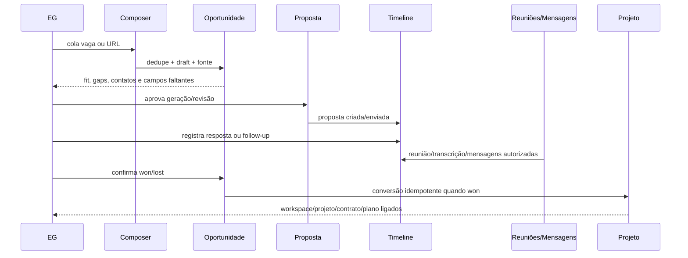

# Spec — Bioma Experience V2 · Fase 0

**Status:** corte vertical implementado; validação operacional externa pendente
**Data:** 2026-08-30
**Escopo:** contrato de produto, domínio, implementação do primeiro corte e validação
**Documento pai:** `PLANEJAMENTO-BIOMA-EXPERIENCIA-V2.md`

---

## 0.1 Evidência de implementação

| Contrato | Implementação do corte |
|---|---|
| Entrada simples | `@Propostas`, colagem de briefing/vaga e ação reversível `capture_opportunity` no Copilot |
| Continuidade | `copilot_thread_entities`, `commercial_activities`, contexto de oportunidade/proposta/projeto/tarefa |
| UI viva segura | `CopilotBlock` e `copilot_runs.response_blocks`; nenhuma renderização de HTML/JS do modelo |
| Jornada comercial | detalhe de oportunidade, estágio, próxima ação, timeline, follow-up revisável e associação com Sales Copilot |
| Trabalho verificável | contexto, critérios de aceite e Definition of Done separados em `eg_tasks` |
| Work Graph | `work_items`, `work_entity_links`, API e visão de rastreabilidade dentro de Projetos & Operação |
| Cliente | projeção de atenção/progresso e solicitações orientadas a resultado, sem liberar backlog interno |
| Contratos | migration `0106`, OpenAPI regenerado e tipos frontend sincronizados |

O corte não declara como live o que depende de provider: gerar texto com conta
real, ingerir WhatsApp ou reunião externa e enviar follow-up continuam exigindo
configuração, consentimento, HITL e smoke no ambiente autorizado.

---

## 0. Goal

### Problema

O Bioma já possui CRM mínimo, oportunidades, propostas, Sales Copilot, projetos, tarefas, documentos, Studio, memória, skills e workspace do cliente. Essas capacidades são reais, mas vivem em superfícies e agregados parcialmente separados. A pessoa precisa conhecer módulos, reconstruir contexto e manter backlogs/documentos paralelos.

### Resultado esperado

Entregar um contrato implementável para uma experiência conversacional que:

1. recebe uma intenção num composer universal;
2. infere ou aceita `@especialista` explícito;
3. torna o contexto visível e corrigível;
4. materializa trabalho nas entidades canônicas;
5. preserva continuidade entre conversa, comercial, projeto e cliente;
6. mostra UI tipada sob demanda;
7. liga Goal, spec, decisões, stories, tarefas, testes e assets.

### Critérios de passe da Fase 0

- jornada EG e jornada cliente descritas separadamente;
- oportunidade definida como agregado comercial canônico;
- compatibilidade com tabelas/serviços atuais mapeada;
- estados e eventos da timeline comercial definidos;
- catálogo inicial de blocos com fonte, timestamp e ação permitida;
- capabilities de EG e cliente definidas por papel;
- Work Graph e destino de `tasks.md` definidos;
- migração aditiva e rollout por feature flags descritos;
- testes de autorização, contrato, migração, UI e operação especificados;
- decisões irreversíveis identificadas como ADR; decisões reversíveis permanecem nesta spec.

### Stop conditions

Interromper antes de código quando:

- não houver consenso sobre oportunidade canônica;
- um fluxo exigir remover ou reinterpretar dado atual sem migração compatível;
- capability do cliente não tiver política deny-by-default;
- bloco visual depender de HTML/JS arbitrário vindo do modelo;
- provider externo for necessário sem contrato `preview/live`, consentimento e smoke definido;
- duas entidades passarem a ser fonte de verdade para o mesmo estado.

### Fora de escopo

- reescrever frontend/backend;
- substituir toda a navegação por canvas;
- atingir paridade com Monday, ClickUp, YouTrack ou Microsoft Project;
- inbox WhatsApp live sem adapter/webhook validado;
- publicação social automática;
- migração RustFS em produção;
- instalar skills locais diretamente pelo navegador.

---

## 1. Princípios do produto

1. **Chat é superfície de comando; entidades são fonte de verdade.**
2. **Inferir por padrão, explicitar quando necessário.** `@Propostas` e outros especialistas são atalhos, não silos.
3. **Contexto sempre visível.** Escrita ambígua exige confirmação.
4. **UI gerativa dentro de um catálogo fechado.** O modelo propõe intenção; o servidor materializa componentes confiáveis.
5. **Um evento, uma timeline.** Fonte, direção, ator, timestamp e idempotência são obrigatórios.
6. **Cliente vê resultado e decisões compartilhadas.** Não recebe uma cópia reduzida da operação interna.
7. **Documentação proporcional ao risco.** ADR é exceção arquitetural, não ritual de toda tarefa.
8. **Frontend-first é contrato de comportamento.** Fixtures não podem ser confundidas com provider ou dado live.
9. **Validação local não prova operação real.** Cada gate declara o limite da evidência.

---

## 2. Participantes das jornadas

Esta seção descreve **atores de negócio**, não cargos fixos, tipos de conta ou
níveis de acesso. A mesma pessoa pode atuar como responsável comercial em uma
oportunidade, líder em um projeto e aprovadora em uma entrega. O que ela pode
ler ou executar em cada contexto continua sendo decidido pelas capabilities e
políticas de autorização da seção 5.

| Ator na jornada | Intenção no momento |
|---|---|
| Pessoa capturando uma oportunidade | transformar uma vaga, conversa, indicação ou briefing solto em continuidade comercial rastreável |
| Responsável pelo relacionamento comercial | avançar contato, follow-up, reunião, proposta, negociação e fechamento sem reconstruir contexto |
| Líder de projeto ou estratégia | converter o que foi vendido em objetivo, escopo, plano, decisões e entregas verificáveis |
| Pessoa executora ou especialista | entender o resultado esperado, produzir o trabalho e registrar evidência sem navegar por fontes paralelas |
| Curador de conhecimento ou assets | avaliar procedência, qualidade, licença e possibilidade de reutilização |
| Cliente patrocinador ou decisor | entender atenção, progresso e resultado, além de aprovar ou pedir ajuste no que lhe foi compartilhado |
| Cliente participante | enviar insumos, responder solicitações, comentar e acompanhar acordos dos quais participa |

### 2.1 Participantes sistêmicos

Agente de IA, worker, adapter e provider são participantes sistêmicos, não
personas. Eles sintetizam, propõem ou executam somente operações do catálogo
permitido, com fonte, modo preview/live, confirmação quando aplicável, custo,
retry e auditoria.

### 2.2 Atores não são RBAC

- **Ator da jornada:** intenção e responsabilidade naquele fluxo.
- **Papel/capability:** permissão concedida a uma identidade em um escopo.
- **Owner/assignee:** responsabilidade registrada em uma entidade concreta.
- **Participante sistêmico:** componente que auxilia ou executa uma operação.

Nenhuma dessas classificações deve ser inferida a partir de outra. Em
particular, aparecer como ator, owner ou origem de um vínculo nunca concede
acesso.

---

## 3. Experience Shell

### 3.1 Composer universal

O mesmo composer aceita:

- texto livre;
- URL;
- arquivo/anexo;
- transcrição;
- comando/skill explícito com `@especialista`;
- referência a entidade já materializada.

Exemplos:

```text
Colei esta vaga. Faça a proposta.
@Propostas use o case Univet e me mostre o que ainda falta provar.
Ele não respondeu. Prepare um follow-up para WhatsApp na terça.
Essa é a transcrição da reunião; atualize a oportunidade e gere o briefing do projeto.
@Engenharia transforme esta ideia numa Spec Lite e num plano de testes.
```

### 3.2 Resolução de especialista

Ordem:

1. `@especialista` explícito e autorizado;
2. entidade ativa da thread;
3. intenção classificada com confiança suficiente;
4. sugestão de especialista quando houver duas opções plausíveis;
5. conversa geral sem ação quando a intenção continuar ambígua.

O especialista seleciona prompt, skills, actions e blocos permitidos. Ele não muda tenancy nem amplia capabilities.

### 3.3 Envelope de contexto

```json
{
  "thread_id": "uuid",
  "message": "string",
  "specialist": "proposals|null",
  "observed_context": {
    "workspace_id": "uuid|null",
    "project_id": "uuid|null",
    "opportunity_id": "uuid|null",
    "proposal_id": "uuid|null",
    "task_id": "uuid|null"
  },
  "confirmed_context": {
    "entity_type": "opportunity",
    "entity_id": "uuid"
  },
  "attachments": []
}
```

Regras:

- `observed_context` descreve rota/seleção; não autoriza por si só;
- `confirmed_context` é escolha explícita ou última escolha confirmada da thread;
- servidor recalcula acesso para cada entidade;
- escrita nunca escolhe workspace apenas por similaridade de nome;
- thread pode relacionar várias entidades, mas possui um foco ativo por run.

### 3.4 Catálogo inicial de blocos

| Bloco | Conteúdo | Ações |
|---|---|---|
| `context_selector` | opções de contexto e motivo da ambiguidade | escolher/cancelar |
| `attention_queue` | aprovações, bloqueios, prazos e solicitações | abrir/resolver |
| `opportunity_summary` | fonte, contato, estágio, fit, gaps, próxima ação | editar/qualificar/arquivar |
| `timeline` | eventos comerciais ou de projeto | filtrar/abrir origem |
| `score_explainer` | score, pilares, pesos, gargalo e evidência | explorar/criar ação |
| `project_summary` | objetivo, fase, entregas, riscos e próxima decisão | abrir/perguntar |
| `task_list` | trabalho filtrado por contexto | criar/editar/concluir permitido |
| `document` | versão, visibilidade, fonte e conteúdo/preview | abrir/comentar/aprovar |
| `approval` | efeito, risco, snapshot e idempotency key | aprovar/rejeitar |
| `client_request` | pedido, triagem, impacto e status | enviar/triagem/responder |
| `workflow_progress` | etapas, retries, bloqueios e checkpoint | cancelar/retomar permitido |
| `navigation_hint` | deep link para superfície especializada | abrir |

Todos os blocos possuem `schema_version`, `entity_refs`, `source_refs`, `generated_at`, `visibility`, `generation_mode` e `allowed_actions` resolvidos no servidor.

### 3.5 Uso dos protótipos HTML

- `living-ai-ui.html`: referência do estado vazio e da composição progressiva.
- `photon_creative_intelligence_studio (1).html`: referência para relação/lineage e inspector; canvas é visão opcional.
- `bioma-score-component.html`: referência de `score_explainer` com método e gargalo.

Não copiar interpretação client-side por palavras-chave, dados simulados sem rótulo, posicionamento absoluto como layout operacional ou estado apenas em `localStorage`.

---

## 4. Jornada comercial canônica

### 4.1 Estado atual

| Conceito | Implementação atual | Limite |
|---|---|---|
| Lead | `leads` | mistura contato, empresa e negócio |
| Captura/oportunidade | `opportunity_radar` | global/admin e orientada a plataforma |
| Proposta | `commercial_proposals.opportunity_id` | continuidade existe só a partir da proposta |
| Reunião | `sales_copilot_sessions.workspace_id/proposal_id` | reunião pré-proposta não aponta à oportunidade |
| WhatsApp | provider + envio + logs por workspace | não há inbox/threading/ingestão comercial |
| Conversão | `proposal_conversions` | ponte idempotente já adequada |

### 4.2 Decisão de domínio

A **oportunidade** é a raiz da jornada comercial. No primeiro ciclo, o serviço promove/generaliza `opportunity_radar` sem exigir rename físico imediato.

Lead passa a representar contato/relacionamento. Estágio, valor, owner e resultado pertencem à oportunidade.

### 4.3 Estado da oportunidade

```text
draft → new → qualifying → meeting → proposal → negotiating → won
                                                └────────────→ lost
qualquer não terminal → archived
```

Regras:

- `draft` pode ser criado automaticamente após captura deduplicada;
- qualificação exige avaliação ou ação explícita;
- `proposal` exige proposta relacionada;
- `won` exige confirmação e pode iniciar conversão idempotente;
- `lost` exige motivo estruturado;
- eventos passados não são apagados por mudança de estágio.

### 4.4 Timeline comercial

Tipos iniciais:

```text
source_captured
opportunity_created
contact_linked
stage_changed
note_added
proposal_created
proposal_versioned
proposal_sent
proposal_viewed
response_received
follow_up_scheduled
follow_up_sent
meeting_scheduled
meeting_completed
transcript_attached
meeting_summary_created
message_imported
message_sent
contract_created
opportunity_won
opportunity_lost
project_converted
```

Cada evento possui:

- `opportunity_id`;
- `event_type` fechado;
- `occurred_at` e `recorded_at`;
- `actor_type/actor_id`;
- `source_kind/source_ref`;
- `direction` quando comunicação;
- payload versionado;
- `visibility` interno/cliente;
- idempotency key quando externo/materializado.

### 4.5 Fluxo ponta a ponta



### 4.6 Migração aditiva proposta

Ainda não executar. Candidato para ADR de schema:

1. adicionar tenancy/workspace/owner e estágios ampliados a `opportunity_radar`;
2. criar relação oportunidade ↔ leads/contatos;
3. criar `commercial_activities`;
4. adicionar `opportunity_id` opcional a Sales Copilot;
5. relacionar threads à oportunidade por tabela de contexto;
6. adicionar referência de oportunidade/contato aos logs/importações de mensagem;
7. backfill de propostas e sessões existentes quando a relação for inequívoca;
8. preservar `proposal_conversions` como ponte para projeto/contrato.

Nenhum backfill deve inferir vínculo por nome de pessoa/empresa sem revisão.

---

## 5. Experiência do cliente

### 5.1 Princípio

O cliente não entra para “operar o Bioma”. Ele entra para:

- entender situação e próxima decisão;
- acompanhar progresso e resultado;
- aprovar ou pedir ajuste;
- enviar insumo;
- consultar documentos e acordos;
- fazer perguntas no contexto autorizado.

### 5.2 Home/Conversa

Ordem visual:

1. **Precisa de você:** aprovações, perguntas, documentos e decisões.
2. **O que mudou:** atualizações desde a última visita.
3. **Em andamento:** objetivos, fases e entregas compartilhadas.
4. **Próximos marcos:** reuniões, prazos e dependências do cliente.
5. **Resultados:** métricas com período, fonte e interpretação.
6. **Composer:** perguntar, enviar insumo ou solicitar mudança.

### 5.3 Solicitação do cliente

Solicitação não cria tarefa interna diretamente.

```text
submitted → triaging → needs_information → accepted | declined
accepted → planned → in_progress → delivered → closed
```

Triagem registra:

- relação com projeto/entrega;
- dentro/fora de escopo;
- impacto em prazo/custo/prioridade;
- resposta da EG;
- necessidade de aprovação comercial;
- tarefa(s) interna(s) materializadas, se aceita.

### 5.4 Projeção compartilhada

| Interno EG | Cliente vê |
|---|---|
| tarefas e subtarefas internas | fase/entrega e resumo relevante |
| comentários internos | apenas comentários `client_visible` |
| risco técnico detalhado | impacto, ação e nova previsão aprovados |
| memória e prompts internos | resposta com fonte autorizada |
| custo/cota/model routing | modo preview/live quando relevante |
| proposta de ação do agente | efeito e pedido de aprovação permitido |

### 5.5 Capabilities iniciais

| Capability | EG | Decisor | Colaborador | Leitor |
|---|:---:|:---:|:---:|:---:|
| ler entidade compartilhada | sim | sim | sim | sim |
| perguntar ao Copiloto do workspace | sim | sim | sim | opcional |
| comentar/enviar insumo | sim | sim | sim | não |
| criar solicitação | sim | sim | sim | não |
| aprovar/rejeitar | sim | sim | conforme delegação | não |
| ver operação interna | sim | não | não | não |
| alterar plano/tarefa interna | sim | não | não | não |
| convidar/revogar membro | admin | decisor autorizado | não | não |

### 5.6 User stories de passe do piloto

- cliente identifica o item que precisa de decisão sem orientação;
- pergunta “como está o projeto?” e recebe dado atual com fonte;
- abre/analisa uma entrega e aprova ou pede ajuste;
- envia documento com finalidade/visibilidade;
- cria solicitação e acompanha triagem;
- consulta resumo/acordos de reunião compartilhada;
- vê resultado separado de interpretação/recomendação;
- usuário de outro workspace não acessa qualquer referência por ID ou busca.

---

## 6. Rastreabilidade do trabalho (Work Graph)

**Work Graph** é o nome arquitetural da rede dirigida que conecta o motivo do
trabalho ao que foi decidido, executado e provado. Na interface, a expressão
preferencial é **Rastreabilidade do trabalho**.

Ele não é:

- organograma ou estrutura de pessoas;
- modelo de usuários, papéis ou níveis de acesso;
- substituto do backlog, do projeto ou do repositório de documentos;
- obrigação de adotar banco de dados de grafos;
- motor de workflow que move estados sozinho.

Cada entidade continua na sua fonte de verdade. O grafo guarda relações
auditáveis entre essas entidades e permite responder: **por que isto existe?**,
**o que implementa?**, **como se prova?** e **o que reutiliza?**

### 6.1 Cadeia canônica

```text
Goal
└── Spec
    ├── Stories/Cenários
    ├── Decision Notes
    ├── ADRs necessários
    ├── protótipos/assets
    └── Plan
        ├── Deliverables
        ├── Tasks
        ├── Tests/Evidence
        └── Release
```

### 6.2 Relações

```text
derives_from
implements
tests
evidences
decides
blocks
supersedes
reuses
materializes
```

O serviço valida existência, tenancy e autorização dos dois lados. A relação é
somente rastreabilidade: não concede acesso ao destino, não muda owner e não
herda permissões. A API só devolve um nó relacionado quando o solicitante já
tem capability para consultar esse nó na sua fonte de verdade.

### 6.3 Evolução da tarefa

Contrato alvo:

```json
{
  "title": "string",
  "description": "contexto, problema e resultado esperado",
  "acceptance_criteria": "comportamento específico verificável",
  "definition_of_done": "gates técnicos desta tarefa",
  "story_refs": ["US-B6"],
  "project_id": "uuid",
  "assignee_id": "uuid",
  "owner_id": "uuid"
}
```

Migração compatível proposta:

1. adicionar `acceptance_criteria` e `definition_of_done`;
2. copiar a descrição atual para `definition_of_done`, sem apagar o campo original;
3. marcar registros migrados para revisão semântica;
4. nova UI passa a usar descrição como contexto/resultado;
5. remover ambiguidade apenas depois de revisão/backfill real.

Checklist continua sendo passos da mesma tarefa. Subtarefa continua sendo tarefa filha com owner/prazo próprios.

### 6.4 `tasks.md`

- congelar criação de novo `tasks.md` como backlog canônico;
- identificar módulos com `tasks.md` e tarefas reais;
- converter itens válidos em tarefas idempotentes ou relações a tarefas existentes;
- manter documento original como snapshot de migração;
- aba Engenharia passa a mostrar a projeção das tarefas relacionadas à spec.

### 6.5 Project plan

Hoje a materialização cria fases e entregas. Evolução proposta:

- item `deliverable` continua criando entrega;
- item `technical_task` pode criar tarefa real opcional;
- `materialized_task_id` evita replay duplicado;
- `definition_of_done`, subtasks, prioridade e visibilidade são preservados;
- story/spec de origem permanece relacionada.

### 6.6 Registry/Vault

Asset não copia o conteúdo canônico. Registra fonte, versão, licença, avaliação, compatibilidade e relações.

Ao adotar:

1. ligar asset/version à spec ou ADR;
2. gerar tarefas de integração/teste/documentação quando necessário;
3. registrar evidência da versão realmente usada;
4. contabilizar projetos consumidores;
5. revisar quando source/licença/compatibilidade mudar.

---

## 7. Documentação proporcional

### Mudança pequena

- Goal curto;
- critérios de aceite;
- teste/evidência;
- sem ADR por padrão.

### Feature/vertical slice

- Spec Lite;
- stories/cenários;
- estados de UI;
- plano/backlog;
- testes de contrato/aceite;
- Decision Notes quando necessário.

### Arquitetural/regulada

- spec completa;
- ADR por decisão irreversível;
- threat model;
- migração/rollback;
- testes de autorização/isolamento;
- operação/provider smoke.

### Gatilhos de ADR desta iniciativa

1. **Agregado comercial e migração:** promover `opportunity_radar` ou criar nova tabela canônica.
2. **Persistência do Work Graph:** relações genéricas validadas em serviço versus joins específicos com FKs.
3. **Política de IA para cliente:** providers, retenção, consentimento e dados permitidos.

Composer, nomes dos modos, ordem dos blocos e layout são decisões reversíveis desta spec; não exigem ADR.

---

## 8. Frontend-first

### Protótipos contratuais

Criar primeiro com fixtures explícitas:

1. EG vazio → colar vaga → oportunidade materializada;
2. oportunidade → proposta → follow-up → reunião → conversão;
3. cliente vazio → fila de atenção → pergunta → aprovação;
4. tarefa → contexto/aceite/DoD separados;
5. spec → stories/tarefas/testes/assets relacionados;
6. score comercial → método → gargalo → ação.

Cada protótipo inclui:

- loading;
- vazio;
- sucesso;
- erro recuperável;
- sem permissão;
- contexto ambíguo;
- provider indisponível;
- ação aguardando aprovação;
- mobile/reduced motion.

Fixtures usam rótulo `Dados simulados` e nunca entram em métricas reais.

---

## 9. TDD e matriz de cobertura

### Camadas

1. testes de schema/contrato dos blocos;
2. testes de state machine comercial;
3. testes de idempotência da captura, timeline e conversão;
4. testes de autorização BOLA/IDOR;
5. testes de migração em banco vazio e upgrade;
6. testes de componente/rotas/acessibilidade;
7. testes E2E dos vertical slices;
8. provider smoke separado quando houver modo live;
9. teste visual e usabilidade com EG/cliente.

### Matriz mínima

| Story | Contrato | Auth | UI | E2E | Operação real |
|---|---|---|---|---|---|
| Colar vaga | obrigatório | obrigatório | obrigatório | obrigatório | URL/provider quando aplicável |
| Follow-up | obrigatório | obrigatório | obrigatório | obrigatório | envio live separado |
| Conversão | obrigatório | obrigatório | opcional | obrigatório | banco/staging |
| Cliente pergunta | obrigatório | crítico | obrigatório | obrigatório | provider + dados reais autorizados |
| Cliente aprova | obrigatório | crítico | obrigatório | obrigatório | staging/auditoria |
| Spec → tarefa | obrigatório | obrigatório | obrigatório | obrigatório | repo/workspace real |

---

## 10. Segurança e governança

- toda entidade comercial recebe tenancy explícita antes de exposição fora do backoffice;
- cliente usa capability policy deny-by-default;
- relação entre entidades nunca concede acesso transitivamente;
- PII de contato não entra em log/model context sem finalidade;
- reunião/transcrição exige consentimento e retenção;
- WhatsApp importado registra autorização, origem e direção;
- mensagem externa e ação visível ao cliente exigem HITL conforme política;
- blocos resolvem dados no servidor e não carregam segredo bruto;
- snapshot usado na aprovação é imutável;
- exclusão/retention precisa considerar timeline, contrato e obrigação legal;
- uso de IA pelo cliente tem política/provider/retention próprios.

---

## 11. Observabilidade e métricas

### Produto

- tempo composer → oportunidade;
- dedupe evitado;
- tempo oportunidade → primeira proposta;
- follow-ups no prazo;
- conversão sem recadastro;
- tempo do cliente até próxima ação;
- latência de aprovação e triagem;
- stories cobertas por tarefa/teste;
- assets reutilizados por projeto.

### Sistema

- contexto inferido/corrigido;
- bloco renderizado/ignorado;
- action proposta/aprovada/executada/falha;
- idempotent replay;
- provider, modelo, custo e duração;
- falhas de autorização;
- eventos SSE perdidos/reconectados, quando existir.

Nenhuma métrica registra conteúdo sensível da conversa por padrão.

---

## 12. Rollout e rollback

1. fixtures/protótipos sem escrita;
2. EG interna com composer e blocos sobre APIs existentes;
3. contexto multi-entidade e oportunidade em flag;
4. jornada comercial com importações manuais;
5. Work Graph e migração controlada de `tasks.md`;
6. cliente piloto em workspace isolado;
7. providers live um a um;
8. expansão por organização/papel.

Flags separadas:

```text
experience_v2_internal
experience_v2_client
typed_run_blocks
commercial_journey_v2
work_graph
client_requests
```

Rollback desabilita nova experiência/escritas V2 sem apagar entidades materializadas. Migrações são aditivas até uso real confirmar o contrato.

---

## 13. Backlog da Fase 0

### Slice 0A — Fechar produto

- revisar Goal e non-goals;
- aprovar experiências EG/cliente;
- aprovar stories prioritárias;
- selecionar cinco blocos iniciais.

### Slice 0B — Fechar domínio comercial

- escolher evolução de `opportunity_radar`;
- definir contato/empresa no primeiro corte;
- fechar estados/eventos;
- desenhar backfill e compatibilidade.

### Slice 0C — Fechar Work Graph

- escolher relações genéricas versus joins específicos;
- fechar contrato documental;
- fechar migração de tarefa/`tasks.md`;
- decidir materialização de plan item em tarefa.

### Slice 0D — Fechar segurança do cliente

- matriz de capabilities;
- política de IA/retention;
- threat model BOLA/IDOR;
- solicitações, uploads, reuniões e aprovações.

### Slice 0E — Protótipos e testes

- estados frontend-first;
- fixtures versionadas;
- matriz story → teste;
- métricas e eventos;
- plano de rollout/rollback.

---

## 14. Decisões abertas e defaults

| Decisão | Default desta spec |
|---|---|
| Nome visível do agregado | Oportunidade; “Lead” fica para pessoa/relacionamento na transição |
| Evolução física | promover `opportunity_radar` primeiro; rename só depois |
| Criação ao colar vaga | `draft` reversível após dedupe |
| Especialista | inferência + `@especialista` explícito |
| WhatsApp inicial | importação manual estruturada |
| Cliente inicial | atenção, conversa, aprovação, solicitação e docs |
| Task fields | contexto/resultado + aceite + DoD separados |
| `tasks.md` | projeção/migração; não segundo backlog |
| Canvas | visão opcional para relações complexas |
| ADR | apenas três candidatos arquiteturais listados nesta spec |

---

## 15. Definition of Ready para implementação

Código só começa quando:

1. Goal e critérios de passe forem aprovados;
2. protótipos EG/cliente cobrirem estados críticos;
3. agregado comercial e migração tiverem decisão registrada;
4. capabilities e threat model forem revisados;
5. schemas de contexto/blocos/eventos estiverem versionados;
6. destino de `tasks.md` e task fields estiver fechado;
7. testes de aceite tiverem IDs de stories;
8. rollout/rollback estiverem exercitáveis;
9. dados simulados e live tiverem apresentação distinta;
10. worktree e alterações concorrentes forem novamente inspecionados.
