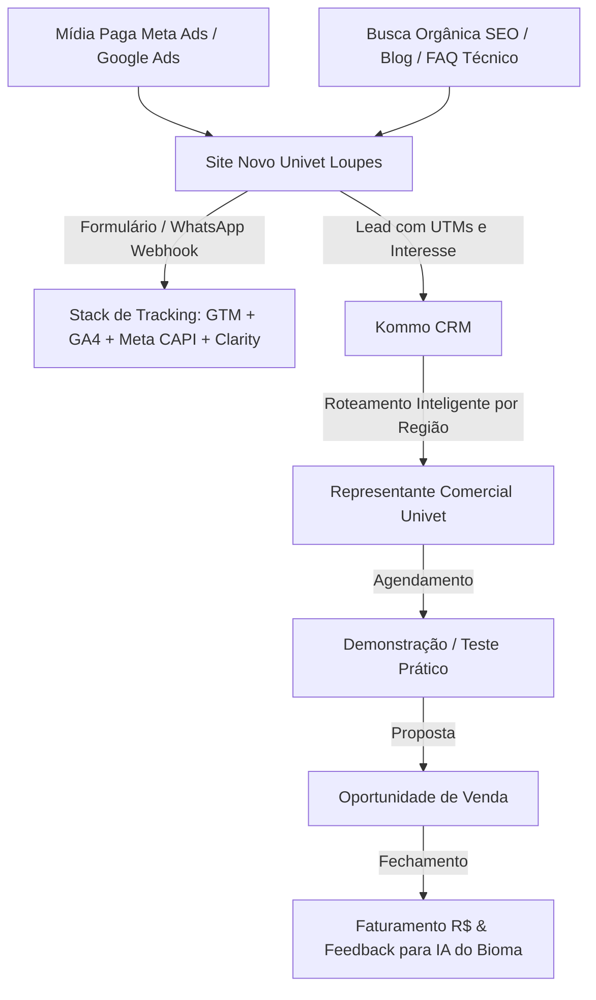

# Univet Loupes — Documento Canônico de Contexto, Estratégia e Backlog

Este documento serve como fonte canônica de contexto para os agentes de inteligência artificial, engenharia e novos operadores do **Bioma** (backoffice da EverGreen Agency) sobre o projeto da **Univet Loupes (Sistemas Ópticos & Lupas de Alta Precisão)**.

---

## 1. Visão Executiva & Propósito

- **Cliente**: Univet Loupes (OTLA Comércio de Equipamentos de Proteção Individual e de Sistemas Ópticos Ltda. — Divisão Loupes).
- **Parceiro Estratégico**: EverGreen Agency (EG).
- **Segmento**: Lupas cirúrgicas binoculares e sistemas ópticos de alta ampliação e iluminação LED para **cirurgiões-dentistas** e **especialidades médicas** (cirurgia plástica, cirurgia vascular, microcirurgia, neurocirurgia, oftamologia, etc.).
- **Ticket Médio de Venda**: R$ 8.500 a R$ 25.000+ por conjunto (óptica personalizada, distância pupilar, magnificação e iluminação coaxial).
- **Modelo de Venda**: B2B / Venda Consultiva de Alto Valor. A conversão final quase sempre depende de:
  1. Identificação da necessidade técnica (ergonomia, fadiga postural, precisão cirúrgica).
  2. Demonstração prática e calibração de medidas (feita por representante regional ou evento).
  3. Proposta comercial formal e fechamento com acompanhamento rigoroso.
- **Eixo Central do Contrato**: Superar a mentalidade de "geração de leads soltos" e construir uma máquina previsível de aquisição que mensure **Campanha → Lead Qualificado → Demonstração/Oportunidade → Venda Fechada (R$)**.

---

## 2. Personas & Jornada de Decisão

### Persona A: Cirurgião-Dentista (Odontologia de Alta Performance)
- **Subespecialidades**: Endodontia, Periodontia, Implantodontia, Odontologia Estética e Prótese.
- **Dores Crônicas**: Dores cervicais e lombares, fadiga visual ao final do dia, necessidade de enxergar canais radiculares e margens de preparo com máxima nitidez.
- **Fatores de Decisão**: Ergonomia verdadeira (trabalhar ereto sem inclinar o pescoço), campo de visão amplo, peso reduzido da armação e fidelidade de cor da iluminação LED.
- **Objeção Típica**: "Lupa boa é muito cara", "já tentei uma genérica e me deu dor de cabeça" (falta de calibração personalizada).

### Persona B: Cirurgião Médico Especialista (Medicina de Alta Precisão)
- **Subespecialidades**: Cirurgia Plástica, Cirurgia Vascular, Neurocirurgia, Microcirurgia Reconstrutiva, Oftalmologia.
- **Dores Crônicas**: Procedimentos longos (4 a 8 horas), necessidade de transição visual rápida, iluminação cirúrgica central sem sombras.
- **Fatores de Decisão**: Prestígio internacional da marca italiana, certificações óticas, robustez, assistência técnica e suporte do representante local.
- **Objeção Típica**: Falta de tempo para reuniões comerciais; exige agendamento cirúrgico rápido de demonstração in loco.

---

## 3. Arquitetura do Sistema e Stack de Tecnologia

### Componentes Técnicos:
1. **Site Novo Univet**: Desenvolvido para velocidade máxima, mobile-first, catálogo claro de lupas (Galileanas, Prismáticas e Ergonômicas) e formulários com captura completa de especialidade médica/odonto e região.
2. **Integração Kommo CRM**:
   - Webhook direto do formulário do site e do botão de WhatsApp para o Kommo.
   - Envio automático dos parâmetros: `utm_source`, `utm_medium`, `utm_campaign`, `utm_content`, `utm_term`, `produto_interesse`, `especialidade`, `cidade/estado`.
   - Distribuição automática do lead para a esteira do representante comercial responsável pelo estado/região.
3. **Tracking & Mensuração**:
   - **Google Tag Manager (GTM)**: Centralização de tags.
   - **Google Analytics 4 (GA4)**: Eventos padronizados (`lead_submitted`, `whatsapp_click`, `view_product_detail`, `demo_requested`).
   - **Meta Pixel + Conversions API (CAPI)**: Redundância server-side para evitar perda por bloqueadores de anúncios e iOS tracking limits.
   - **Google Ads Conversion Tracking**: Otimização de lances para leads qualificados e ações de alto valor.
   - **Microsoft Clarity**: Gravação de sessões e mapas de calor para auditoria contínua de UX e fricção.

---

## 4. As 3 Frentes Paralelas de Execução

### Frente 1: Growth & Aquisição
- **Objetivo**: Atrair tráfego qualificado de médicos e dentistas com alto poder aquisitivo e intenção clara de compra.
- **Ações Imediatas**:
  - Auditoria das contas legadas do Google Ads e Meta Ads.
  - Estruturação de campanhas segmentadas por interesse/especialidade e intenção de busca (ex: "lupas para endodontia", "lupa cirúrgica ergonômica", "Univet loupes Brasil").
  - Criação de matriz de criativos focada em dor postural e antes/depois da acuidade visual.
  - Definição da cadência semanal de otimização e testes de anúncio.

### Frente 2: Infraestrutura & Implementação
- **Objetivo**: Garantir que nenhum lead seja perdido, que o tempo de resposta do representante seja mínimo e que os dados de vendas retornem para alimentar os algoritmos.
- **Ações Imediatas**:
  - QA completo do site novo da Univet em produção (velocidade, formulários, WhatsApp, layout em smartphones).
  - Configuração do pipeline no Kommo CRM (etapas: Lead Recebido → Contato Inicial → Qualificado → Demonstração Agendada → Proposta Enviada → Ganho / Perdido com motivo).
  - Homologação do tracking ponta a ponta com disparos de leads de teste.
  - Construção do Cockpit executivo de aquisição vs. vendas.

### Frente 3: SEO & Autoridade Orgânica
- **Objetivo**: Construir o canal de menor CAC no médio/longo prazo, dominando termos de busca técnicos e comparativos de lupas cirúrgicas no Brasil.
- **Ações Imediatas**:
  - Auditoria técnica profunda (sitemap.xml, robots.txt, canonical tags, Core Web Vitals, schema markup de produto e organização médica).
  - Setup do Google Search Console e mapeamento de palavras-chave de alta intenção comercial.
  - Otimização on-page das páginas de produtos e categorias.
  - Backlog editorial de conteúdos profundos (ergonomia para dentistas, guia de aumento óptico 2.5x vs 3.5x vs 5.0x, comparativos de armações).

---

## 5. Backlog e Matriz de 90 Dias

| ID | Frente | Tarefa | Prioridade | Janela | Critério de Aceite |
|---|---|---|:---:|:---:|---|
| **P0-01** | Infra | Coleta e validação de acessos (Meta, Google Ads, GTM, GA4, Kommo, Domínio) | **P0** | Dias 1-3 | Todos os acessos concedidos e testados no cofre da EG. |
| **P0-02** | Infra | Auditoria e QA do site novo em produção | **P0** | Dias 2-5 | Formulários, WhatsApp, mobile e performance sem quebras. |
| **P0-03** | Infra | Integração formulários/WhatsApp → Kommo CRM | **P0** | Dias 3-7 | Leads de teste chegam no Kommo com UTMs e região preenchidas. |
| **P0-04** | Infra | Setup completo da stack de tracking (GTM, GA4, Pixel/CAPI, Ads, Clarity) | **P0** | Dias 3-7 | Eventos disparando perfeitamente e validados no Tag Assistant. |
| **P0-05** | Growth | Auditoria do histórico de mídia paga e definição de funil de conversão | **P0** | Dias 4-7 | Relatório de aprendizados passados e mapa oficial de conversão. |
| **P0-06** | SEO | Setup do Google Search Console e auditoria técnica de indexação | **P0** | Dias 5-7 | GSC verificado, sitemap enviado, erros 404/redirects sanados. |
| **P1-01** | Growth | Lançamento das campanhas prioritárias (Google Ads Search + Meta Ads) | **P1** | Dias 8-15 | Campanhas ativas rodando por especialidade (Odonto + Medicina). |
| **P1-02** | Growth | Criação de backlog de novos criativos e testes A/B de anúncio | **P1** | Dias 10-20 | Primeiro lote de criativos autorais entregue para veiculação. |
| **P1-03** | Infra | Treinamento do time de representantes no fluxo do Kommo CRM | **P1** | Dias 8-15 | Representantes atualizando status de demonstração no CRM. |
| **P1-04** | SEO | Pesquisa aprofundada de palavras-chave e arquitetura de páginas | **P1** | Dias 10-25 | Mapeamento de termos transacionais e informacionais concluído. |
| **P1-05** | Infra | Dashboard unificado de aquisição e retorno sobre investimento (ROI) | **P1** | Dias 15-30 | Painel visual mostrando investimento, CPL, reuniões e vendas. |
| **P2-01** | SEO | Produção dos 4 primeiros artigos pilares de alta autoridade técnica | **P2** | Dias 31-60 | Artigos publicados, indexados e rankeando no GSC. |
| **P2-02** | Growth | Otimização de CAPI com eventos offline de compra no CRM | **P2** | Dias 31-60 | Fechamentos no Kommo retroalimentando o algoritmo do Meta Ads. |
| **P2-03** | Growth | Expansão de campanhas regionais alinhadas à rota de representantes | **P2** | Dias 45-75 | Verba alocada conforme agenda presencial de visitas nos estados. |
| **P2-04** | SEO | Otimização contínua de Core Web Vitals e Schema Markup médico | **P2** | Dias 60-90 | Pontuação verde no Google PageSpeed e Rich Results ativos. |
